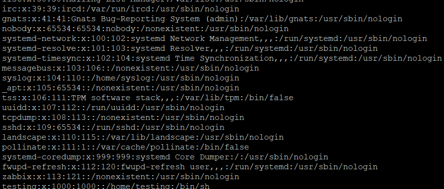

<figure>


<figcaption>

How to Add a User to Sudoers in Ubuntu 18.04

</figcaption>

</figure>

**Description**

In this article we will add new knowledge How to Add a User to Sudoers in Ubuntu 18.04 Add a user to [sudoers](https://utho.com/docs/tutorial/how-to-install-wmclock-on-ubuntu-20-04/) on Ubuntu 18.04. In many cases, you might have seen that a non-privileged user has been given sudo access to perform root actions. This is required in many organisations where some tasks cannot be performed without having root access. Because they cannot provide root user access, [Linux](https://www.linux.org/) admins or system administrators usually grant sudo access to a non-privileged user to perform root operations.

Follow the below steps to how to Add a User to Sudoers in Ubuntu 18.04

## Create a user

We need to make a user to whom we can give sudo access so that they can do administrative work. For our example, we will set up a user test. This must be done by the root user or by any other user who has access to sudo. Here, I'm making the testing user with root.

```
useradd -m testing
```
\-m Creates the user's home directory. The -k option copies the skeleton directory to the home directory. useradd man page details

If this option isn't used and CREATE HOME isn't turned on, no home directories are made by default.

<figure>



<figcaption>

How to Add a User to Sudoers in Ubuntu 18.04

</figcaption>

</figure>

## Set User Password

Use the passwd command to set the testing user's password. When asked, give a strong password and press enter. Type the same password again and hit Enter.

<figure>


<figcaption>

How to Add a User to Sudoers in Ubuntu 18.04

</figcaption>

</figure>

## Find User

```
cat /etc/passwd | grep -i testing
```
<figure>


<figcaption>

How to Add a User to Sudoers in Ubuntu 18.04

</figcaption>

</figure>

test: Name of the User

1000: User Id

1000: Group Id

test,,,,: Section Comments

/home/test: Home Directory of the Test User

/bin/bash: Shell assigned to the user

## Modification of User Group

You must use the usermod command to add users to the sudo group.

```
usermod -aG sudo testing
```
\-a: Add the user to the group of extra people (s). only when you use the -G option. On the usermod Man page, you can find more information.

\-G: A list of other groups that the user belongs to as well. Each group is separated by a comma, and there is no white space in between. The same rules apply to the groups as to the group given with the -g option. On the usermod Man page, you can find more information.

If the user is part of a group that is not on the list, they will be taken out of that group. The -a option can change this behaviour by adding the user to the current supplementary group list.

Now, change to "test user" and use the whoami command to see if the user is in the sudo group.

<figure>


<figcaption>

How to Add a User to Sudoers in Ubuntu 18.04

</figcaption>

</figure>

## Add user in sudoers file

Most of the time, adding the user to the sudo group is enough, but if that doesn't work, it's better to add the user to the /etc/sudoers file, as shown below:

```
visudo /etc/sudoers
```
<figure>


<figcaption>

How to Add a User to Sudoers in Ubuntu 18.04

</figcaption>

</figure>

NOTE: Please remember that you have to use the visudo command to open the /etc/sudoers file to make sure there are no configuration errors in the file.

## Check access of sudo

Now you can run some commands that need sudo access to see if sudo access is working.

<figure>


<figcaption>

How to Add a User to Sudoers in Ubuntu 18.04

</figcaption>

</figure>

You can run any command on the terminal after adding the user's entry to the Visudo file; he will behave as a root user, as shown in the screenshot above. 

<figure>


<figcaption>

How to Add a User to Sudoers in Ubuntu 18.04

</figcaption>

</figure>

I hope you have successfully understood all the things to How to Add a User to Sudoers in Ubuntu 18.04

**Must Read** : [Cheat sheet for 15 nmcli commands in Linux (RHEL/CentOS)](https://utho.com/docs/tutorial/cheat-sheet-for-15-nmcli-commands-in-linux-rhel-centos/)

**Thankyou**
