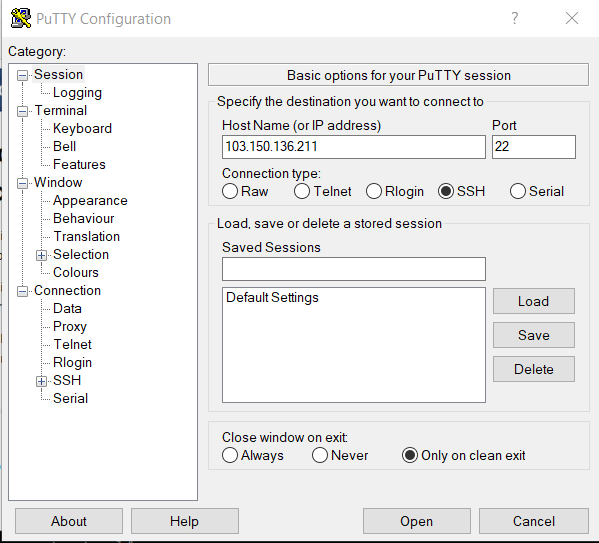
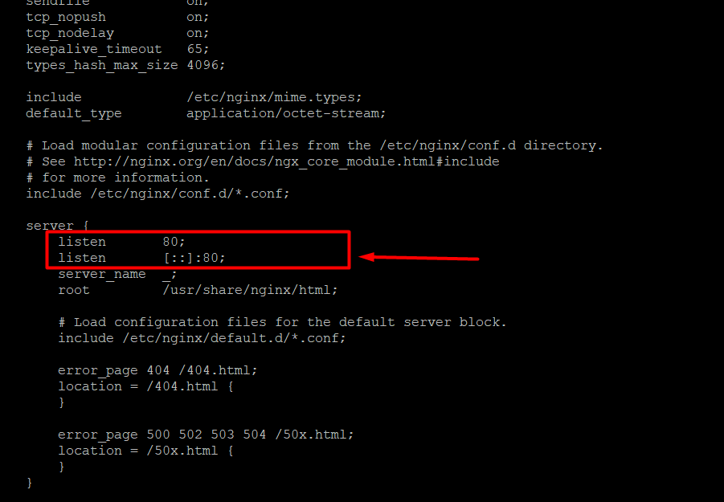

**Step 1:** Check the default port by accessing the server IP address in the browser .

**Step 2:**  Login into the server using root credentials through putty .



**Step 3:** Open Nginx configuration file with a text editor .

```
 # vi /etc/nginx/nginx.conf
```

Press ‘ I ’ for the insert/modification mode .

**Step 4:** Change the default port of the nginx to the custom port

Before change : port is 80 as shown below in screetshot



After change : Port has been changed to 8081 (here) as shown in screenshot


**Step 5** Restart the nginx and network service .

```
 # systemctl status nginx 
```

```
 # systemctl status network 
```

**Step 6:** Now check the webserver while accessing the server IP\_address:8081  in the browser. 

URL: - [http://server\_domain\_name\_or\_IP:8081](http://server_domain_name_or_ip:8081/)


Thank You :)
