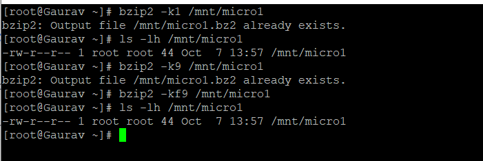
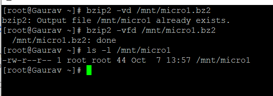

###### **Description**

To compress a file (or files) is to drastically reduce the size of the file (or files) by encoding the data in the file (or files) using fewer bits, and compressing a file (or files) is typically a helpful practise during backup and the transmission of a file (or files) over a network. On the other hand, decompressing a file or files involves bringing the data back to its uncompressed form from before it was compressed.

There are several different file compression and decompression utilities available for use in Linux, including gzip, 7-zip, Lrzip, PeaZip, and many others.

On this article, we will examine how to compress and decompress files with the.bz2 extension in Linux by using the bzip2 programme.

[Bzip2](https://en.wikipedia.org/wiki/Bzip2) is a well-known compression tool, and it is accessible on the majority of the main [Linux](https://utho.com/docs/tutorial/category/linux-tutorial/) distributions, if not all of them. To install Bzip2, you only need to execute the command that is specific to your Linux distribution.

```
#sudo yum install bzip2
```

The following is the usual syntax for using bzip2:

```
#bzip2 option(s) filenames
```

## Tutorial on How to Use "bzip2" to Compress Your Files

You can compress a file by following the instructions below, where the -z switch enables file compression:

```
#bzip2 filename
```

or

```
#bzip2 -z filename
```

Use the format: command in your terminal to compress a.tar file.

```
#bzip2 -z backup.tar
```

**NOTE**: To prevent bzip2 from deleting the input files during compression or decompression, use the -k or —keep option. If you want to keep the files, bzip2's default behaviour is to remove them.

In addition, passing the -f or —force flag to bzip2 will cause it to overwrite an output file that is already present.

- to save the input file

```
#bzip2 -zk filename
```

```
#bzip2 -zk backup.tar
```

You can also change the block size to be between 200k and 950k by using the notations -1 or —fast to -9 or –best, as demonstrated in the examples that follow:

```
#bzip2 -k1 /mnt/micro1
```

```
#ls -lh /mnt/micro1
```


```
#bzip2 -k9 /mnt/micro1
```

```
#bzip2 -kf9 /mnt/micro1
```

```
#ls -lh /mnt/micro1
```

The following image provides a screenshot that demonstrates how to use options to keep the input file, force bzip2 to overwrite an output file, and set the block size before beginning the compression process.



## How to Uncompress Files with "bzip2"

Use the -d or —decompress option, as shown above, in order to decompress a file with the.bz2 extension.

```
#bzip2 -d filename.bz2
```

**NOTE:** In order for the command mentioned above to be successful, the file's name must be followed by the extension.bz2.

```
#bzip2 -vd /mnt/micro1.bz2
```

```
#bzip2 -vfd /mnt/micro1.bz2
```

```
#ls -l /mnt/micro1
```



In order to read the bzip2 help page as well as the man page, use the following command:

```
#bzip2 -h
```

or

```
#man bzip2
```

After reading the brief explanations above, I believe that you are now able to compress and decompress information. files with the bzip2 programme on a Linux operating system. However, if you have any inquiries or comments, please contact us using the comment box below.

Importantly, in order to learn how to use the tar utility in Linux to build compressed archive files, you may wish to review a few important examples of the Tar command.

###### **Thank You**
