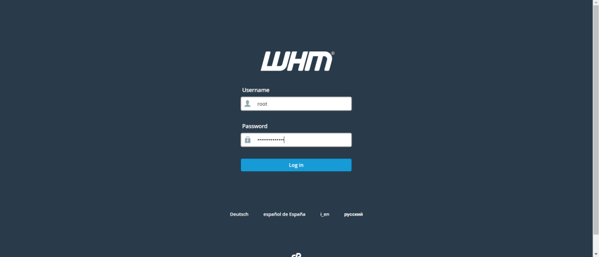
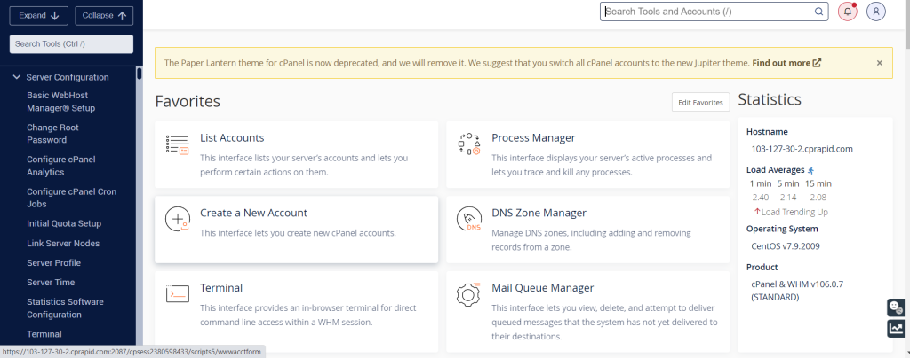
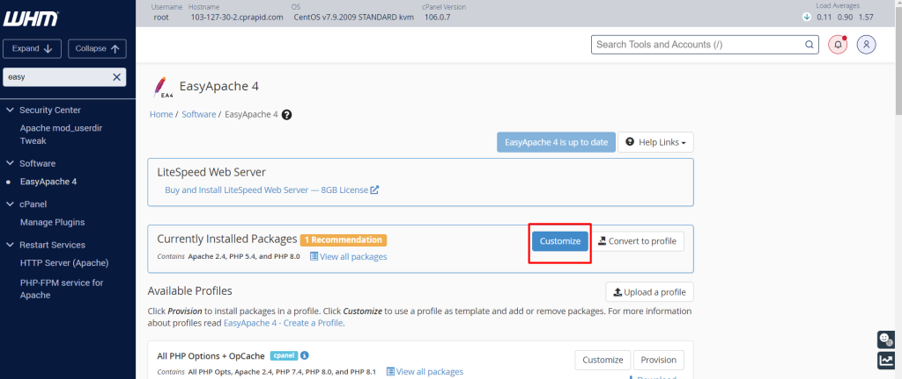
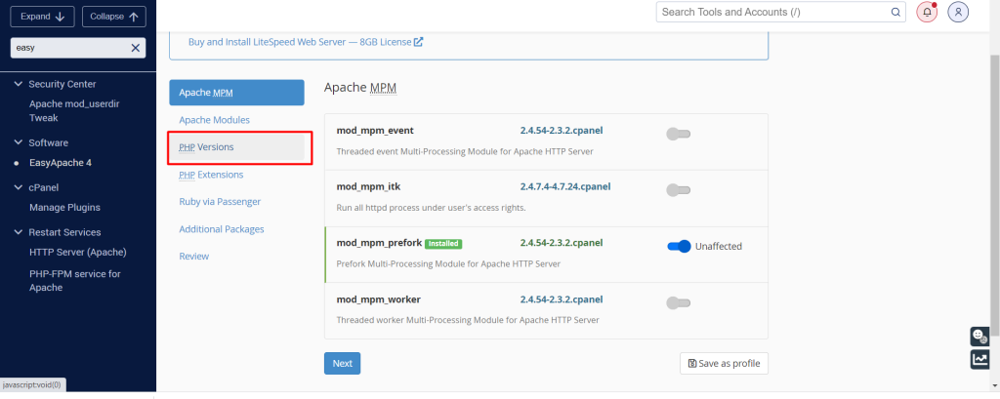
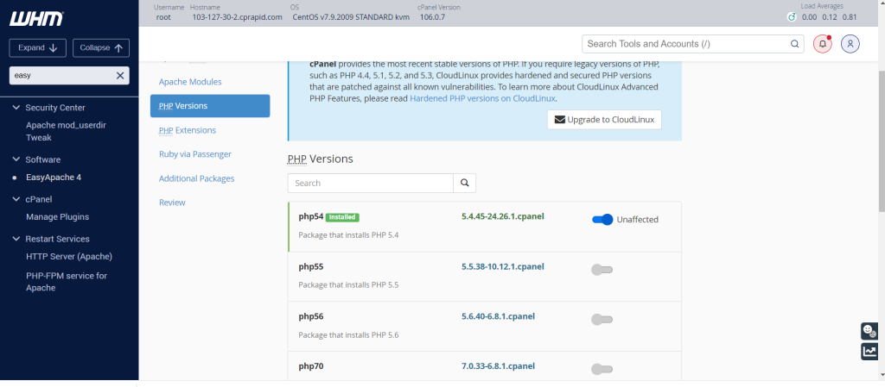

**Description**

**[PHP](https://en.wikipedia.org/wiki/PHP)**, which stands for "Hypertext PreProcessor," is the most popular open source and general purpose server side scripting language. Its primary application is in web development, namely in the production of dynamic websites and applications. Rasmus Lerdorf came up with the idea for it in the year 1994.

**[WHM](https://utho.com/docs/tutorials/how-to-change-the-hostname-of-a-whm-cpanel-server/)** (WebHost Manager) is a control panel that allows users to manage the backend of numerous cPanel accounts. You may manage individual accounts as well as create server-side limits with WHM. This post will explain why you should utilise WHM and how it may help you manage your

Follow the below steps to Install a PHP Version in WHM.....

###### **Procedure**

Here are the measures you need to do to update PHP using WHM.

1.Connect to WHM.

2\. Go to the EasyApache 4 page.

3\. To customise the currently installed packages, click the Customize button.

4\. Click **PHP Versions**.

5\. Click the switch symbol that is located to the far right of the version to indicate that the version should be installed.

6\. When asked, click the option to only install the PHP version or the PHP version and extensions.

7\. Click Review, and then look at the output to make sure that the PHP version you chose will be installed.

8\. When you click Provision, the versions of PHP that you chose will be installed.

## 1\. Connect to WHM.

## 2\. Go to the EasyApache 4 page

## 3\. To customise the currently installed packages, click the Customize button.

## 4\. Click PHP Versions.

## 5\. Click the switch symbol that is located to the far right of the version to indicate that the version should be installed.

## 6\. When asked, click the option to only install the PHP version or the PHP version and extensions

## 7\. Click Review, and then look at the output to make sure that the PHP version you chose will be installed

## 8\. When you click Provision, the versions of PHP that you chose will be installed.

Hope you have understand How To Install a PHP Version in WHM ..continue read..

Must read :- [https://utho.com/docs/tutorial/find-out-all-live-hosts-ip-addresses-connected-on-network-in-linux/](https://utho.com/docs/tutorial/find-out-all-live-hosts-ip-addresses-connected-on-network-in-linux/)

**Thank you**
