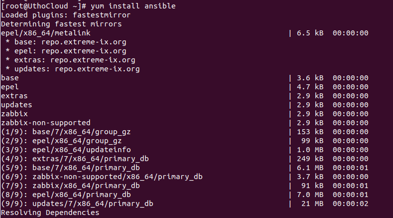

<figure>


<figcaption>

How to install Ansible on CentOS

</figcaption>

</figure>

```
Introduction
```
In this article, you will learn how to install ansible on centos. Administrators and operations teams can easily manage a large number of [servers](https://www.google.com/url?sa=t&rct=j&q=&esrc=s&source=web&cd=&cad=rja&uact=8&ved=2ahUKEwjzt8GGjNP_AhUGRmwGHXsXD5cQFnoECEgQAQ&url=https%3A%2F%2Fen.wikipedia.org%2Fwiki%2FServer_(computing)&usg=AOvVaw1mF3CItuVD4gm9WggOY-74&opi=89978449) thanks to configuration management systems. They give you the ability to automate the control of numerous systems from a single central place. Although there are numerous well-liked configuration management tools for Linux systems, like Chef and Puppet, these are frequently more complicated than many people need or want. Due to its lower startup costs than these alternatives, Ansible is a fantastic substitute.

Ansible operates by setting up client machines from a computer with installed and set up Ansible components. It connects using standard SSH channels to send commands, copy files, and retrieve data from distant machines. Because of this, installing additional software on the client machines is not necessary for an Ansible system. This is one method by which Ansible makes server administration simpler. No matter where a server is in its life cycle or whether it has an open SSH port, Ansible may be used to configure it.

Because Ansible has a modular approach, it is simple to expand it to utilise the functionalities of the primary system to handle particular cases. Any language can be used to write modules, and they communicate using standard JSON. Due to its expressiveness and resemblance to well-known markup languages, YAML data serialisation format is typically used for configuration files. Ansible may communicate with clients using either command-line tools or its Playbooks, or configuration scripts.

## Prerequisites

- Yum repository configured to install packages. You can have you CentOS server [here.](http://cloud.utho.com)

- Any normal user with SUDO privileges or Super user

## Steps to install Ansible on CentOS

Step 1: Ensure that your reposlists are configured and working file.

```
yum repolist
```
<figure>


<figcaption>

All the repositories

</figcaption>

</figure>

Step 2: Install the Extra Packages for Enterprise Linux, EPEL repolist on your machine. As you can see in the above screenshot, I have already installed the EPEL repolist. You can install the same using the below command

```
yum install epel-release -y
```
Step 3: Now, install the Ansible on your CentOS machine.

```
yum install ansible -y
```
<figure>



<figcaption>

Install Ansible on centos

</figcaption>

</figure>

And, this is how you have learnt how to install ansible on centos server
