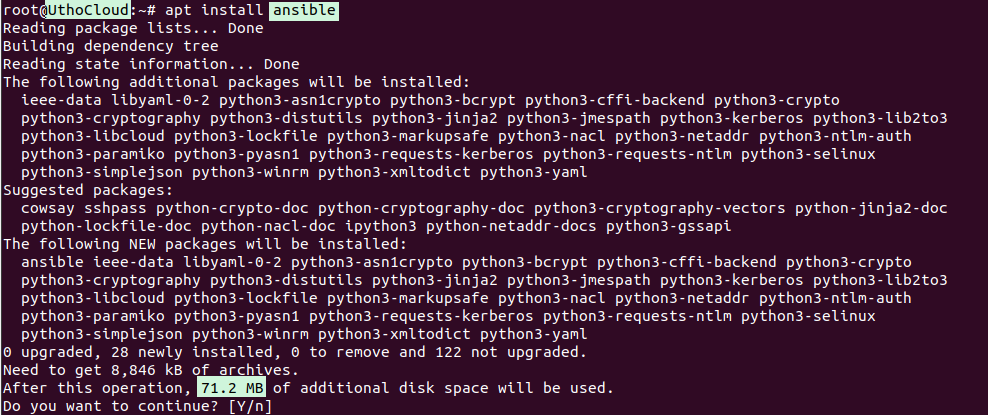

<figure>


<figcaption>

How to install Ansible on Ubuntu

</figcaption>

</figure>

```
Introduction
```
In this tutorial, we will learn how to install Ansible on Ubuntu. Administrators and operations teams can easily manage a large number of servers thanks to [configuration management systems, Ansible](https://www.google.com/url?sa=t&rct=j&q=&esrc=s&source=web&cd=&cad=rja&uact=8&ved=2ahUKEwiy5-qmorv_AhVAa2wGHfMNDz4QFnoECBYQAQ&url=https%3A%2F%2Fwww.ansible.com%2F&usg=AOvVaw3UDsdEZCWLGW0rImAcpggU). They give you the ability to automate the control of numerous systems from a single central place. Although there are numerous well-liked configuration management tools for Linux systems, like Chef and Puppet, these are frequently more complicated than many people need or want. Due to its lower startup costs than these alternatives, Ansible is a fantastic substitute.

Ansible operates by setting up client machines from a computer with installed and set up Ansible components. It [connects using standard SSH channels](https://utho.com/docs/tutorial/how-to-setup-ssh-tunneling-or-port-forwarding-in-linux/) to send commands, copy files, and retrieve data from distant machines. Because of this, installing additional software on the client machines is not necessary for an Ansible system. This is one method by which Ansible makes server administration simpler. No matter where a server is in its life cycle or whether it has an open SSH port, Ansible may be used to configure it.

Because Ansible has a modular approach, it is simple to expand it to utilise the functionalities of the primary system to handle particular cases. Any language can be used to write modules, and they communicate using standard JSON. Due to its expressiveness and resemblance to well-known markup languages, YAML data serialisation format is typically used for configuration files. Ansible may communicate with clients using either command-line tools or its Playbooks, or configuration scripts.

## Prerequisites

- apt repository configured to install packages

- Any normal user with SUDO privileges or Super user

## Steps to install Ansible on Ubuntu server

Step 1: Update your apt repolist before start installing the Ansible on your Ubuntu server.

```
apt-get update
```
<figure>


<figcaption>

Update your repolist

</figcaption>

</figure>

Step 2: Now,Configure the PPA on your system

```
apt install software-properties-common
add-apt-repository --yes --update ppa:ansible/ansible
```
Step 3: Again update the apt repositories

```
apt install ansible -y
```
<figure>



<figcaption>

Install Ansible

</figcaption>

</figure>

Step 4: Verify the installation of the ansible on your server by checking the installed version of Ansible.

```
ansible --version
```
<figure>


<figcaption>

Check the installed version of Ansible

</figcaption>

</figure>

And this is how you have learnt how to install Ansible on Ubuntu server
