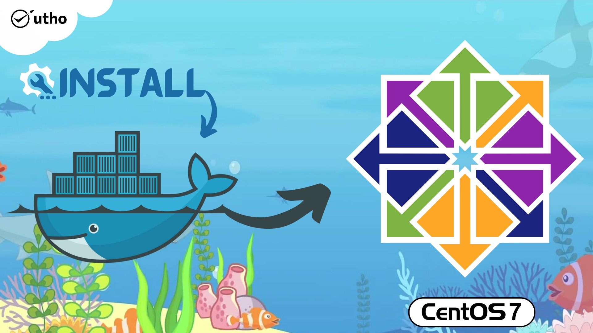
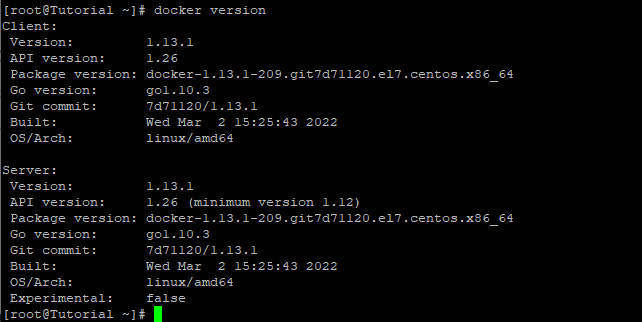

## Introduction

In this article, you will learn how to install Docker on Centos 7.

[Docker](https://en.wikipedia.org/wiki/Docker_(software)) is a platform that is open source and allows developers to build, deploy, run, update, and manage containers. Containers are standardised, executable components that combine application source code with the [operating system](https://utho.com/docs/tutorial/how-to-host-a-domain-on-centos-7/) (OS) libraries and dependencies necessary to run that code in any environment. Docker enables developers to do all of these things.

Containers make it easier to design and deliver applications that run on distributed systems. As more and more businesses move their operations to cloud-native development and hybrid multicloud environments, their adoption rates have increased significantly. Developers have the ability to create containers even without the use of Docker by cooperating directly with features that are pre-installed in Linux and other operating systems. Docker, on the other hand, makes containerization more quickly, easily, and securely.

## Step 1: Update the system

The first step you need to do is get the repositories up to date. To accomplish this, use the following command:

```
# yum update -y
```

## Step 2: Install the Dependencies

For the installation to go off without a hitch, there are some prerequisites or dependencies that must be met. Therefore, in order to install them, execute the following command:

```
# yum install -y yum-utils device-mapper-persistent-data lvm2
```

## Step 3: Add the Docker Repository to CentOS

You will need to integrate the Docker CE stable repository into your operating system in order to install the edge or test versions of Docker. To accomplish this, use the following command:

```
# yum-config-manager --add-repo https://download.docker.com/linux/centos/docker-ce.repo
```

## Step 4: Install Docker

After you have completed all of the necessary preparations, you may at long last go on to installing Docker on CentOS 7 by executing the following command.

```
# yum install docker -y
```

### Step: 5 Manage Docker Service

Docker has been installed on CentOS, but the service is not yet operating even though you have done so.

Enabling a service to run automatically upon system boot will allow it to be started. Carry out each of the commands that follow in the sequence that they are presented.

```
# systemctl start docker
```

```
# systemctl enable docker
```

```
# systemctl restart docker
```

```
# systemctl status docker
```


Execute the following command to check that Docker has successfully installed:

```
# docker version
```



## Conclusion

Hopefully, you have learned how to install Docker on Centos 7.

Thank You 🙂
