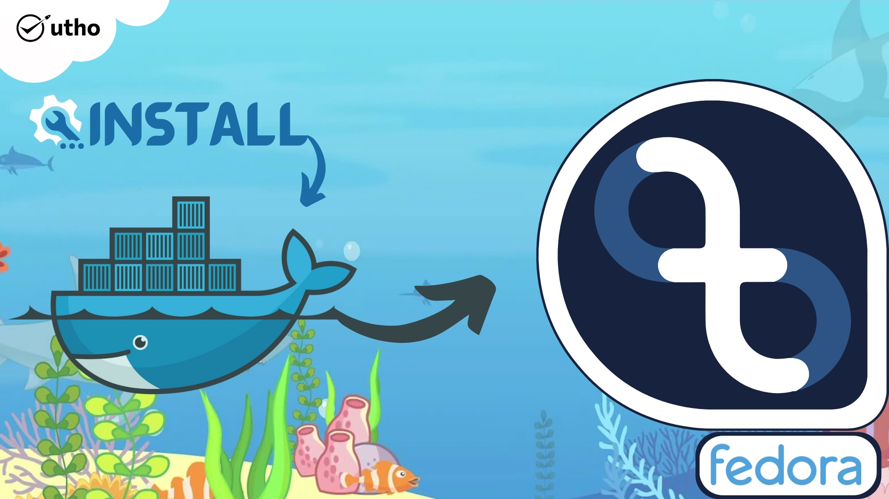

## Introduction

In this article, you will learn how to install Docker on Fedora.

[Docker](https://www.docker.com/) is a platform that is open source and allows developers to build, deploy, run, update, and manage containers. Containers are standardised, executable components that combine application source code with the [operating system](https://utho.com/docs/tutorial/how-to-host-a-domain-on-centos-7/) (OS) libraries and dependencies necessary to run that code in any environment. Docker enables developers to do all of these things.

Containers make it easier to design and deliver applications that run on distributed systems. As more and more businesses move their operations to cloud-native development and hybrid multicloud environments, their adoption rates have increased significantly. Developers have the ability to create containers even without the use of Docker by cooperating directly with features that are pre-installed in Linux and other operating systems. Docker, on the other hand, makes containerization more quickly, easily, and securely.

## Step 1: Update the system

The first step you need to do is get the repositories up to date. To accomplish this, use the following command:

```
# dnf update -y
```

## Step 2: Enable Docker CE Official Repository

```
# dnf -y install dnf-plugins-core
```

```
# dnf config-manager --add-repo https://download.docker.com/linux/fedora/docker-ce.repo
```

## Step 3: Install Docker and its Dependencies

```
# dnf install -y docker-ce docker-ce-cli containerd.io
```

## Step 4: Manage Docker Service

```
# systemctl start docker
```

```
# systemctl enable docker
```

```
# systemctl restart docker
```

```
# systemctl status docker
```


## Step 5: Confirm that Docker is installed

Execute the following command to check that Docker has successfully installed:

```
# docker version
```


## Step 6: Test Docker

In order to evaluate Docker, we will obtain a 'hello-world' image from the Docker Hub repository. A container will be formed from the image that shows a "Hello world" message on the terminal along with the steps of what just transpired after the command has been done. This will take place after the image has been loaded.

```
# docker run hello-world
```


Execute the following command to verify the photos that are currently stored on the system:

```
# docker images
```


## conclusion

Hopefully, you have learned how to install Docker on Fedora.

Thank You 🙂
