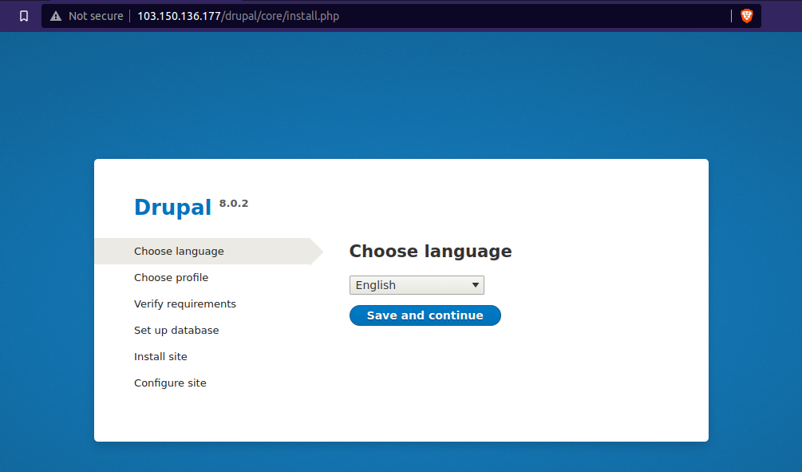
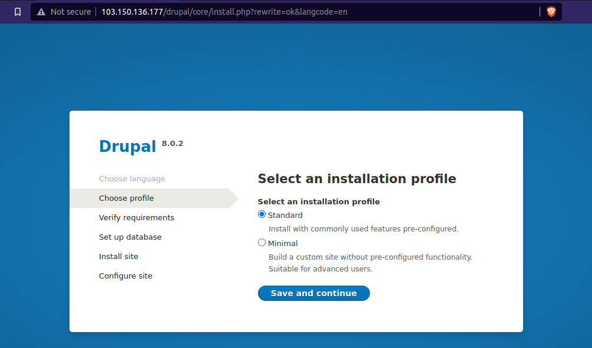
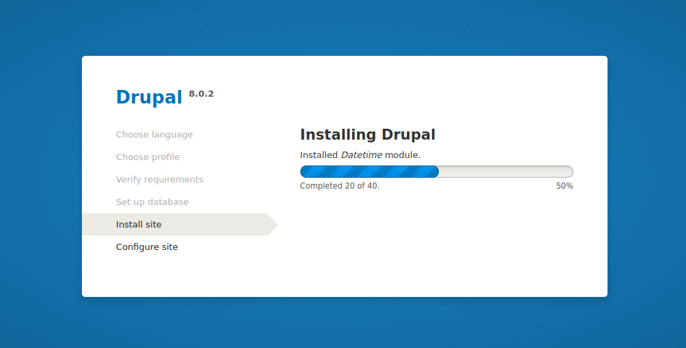
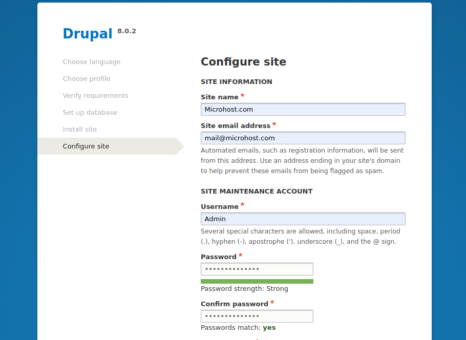
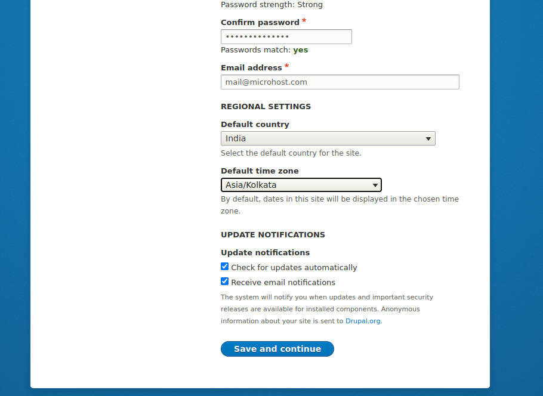

This article will show you how to Install Drupal on CentOS.

Drupal is an open-source content management system that lets us build and edit websites without having to know how to code. The code for Drupal is written in PHP and is licenced by [GNU GPL](https://en.wikipedia.org/wiki/GNU_General_Public_License) (General Public License ).

## Prerequesties

- yum server configured on your centos server
- Apache 2.x (Recommended)
- PHP 5.5.9 or higher (5.5 recommended). To install the latest version of php, [follow this article](https://utho.com/docs/tutorial/how-to-install-latest-versions-of-php-on-centos/).
- MySQL 5.5.3 or MariaDB 5.5.20
- A super user or any other normal user with sudo privileges.

To meet above requirements, you just need to install LAMP server on your machine. Follow this article to [install LAMP on Centos](https://utho.com/docs/tutorial/installation-of-lamp-stack-on-centos-7/)

## 1- Configure MySQL/ Mariadb database for Drupal

We have to create a database and a user for the Drupal site to manage.

```
# mysql -u root -p 
```

> \> CREATE DATABASE microhost\_db;  
> \> CREATE USER microhost\_user@localhost IDENTIFIED BY '\-----------';  
> \> GRANT ALL ON microhost\_db.\* TO microhost\_user@localhost;  
> \> FLUSH PRIVILEGES;  
> \> EXIT;

## 2- Install and configure Drupal

We'll begin by using the wget command to get the most recent Drupal version (i.e. 8.2.6). If you don't already have the wget and tar packages installed, use the following command to get them:

```
# yum install wget tar -y 
```

```
wget https://ftp.drupal.org/files/projects/drupal-8.0.2.tar.gz
```
Use the below command to unzip the downloaded drupal file. Then move the Drupal folder into the Apache Document Root, which is, /var/www/html

```
# tar -zxcf drupal-9.4.6.tar.gz  
```
# mv drupal-9.4.6 /var/www/html/drupal 
```

```

Then, in the folder (/var/www/html/drupal/sites/default), create the settings file settings.php (based on the example settings file default.settings.php), and then establish the proper permissions on the Drupal site directory, including sub-directories and files as follows:

```
cd /var/www/html/drupal/sites/default/
cp default.settings.php settings.php
chown -R apache:apache /var/www/html/drupal/
```
Finally, at this point, go to the URL: http://server IP/drupal/ to launch the online installer, choose your chosen installation language, and click Save to proceed.

```
http://server-ip/drupal 
```

> Note: if your server have php version lower than 5.6, you will encounter the below error when you hit your server-ip on your browser  

<figure>


<figcaption>

Error of having lower version than php 5.6

</figcaption>

</figure>

If you have higher than php5.6 you must see the below page. Here, just select save and continue after selecting favourite language

<figure>



<figcaption>

select language

</figcaption>

</figure>

On the next page, you will be asked to select the installation profile. We have selected the standard option for the sake of this tutorial. After making the choice, just again click on save and continue

<figure>



<figcaption>

second page of the installation

</figcaption>

</figure>

On the third screen, you will be headed to fill the database information you created for the drupal to save the data. After filling up the details, just continue to your path.

<figure>


<figcaption>

Third page to enter the database details

</figcaption>

</figure>

After clicking on the save and continue option on the last page, you have just started the installation of the drupal on your server

<figure>



<figcaption>

Installation process

</figcaption>

</figure>

After installation, you will be asked to enter the details of your site. Just fill up according to your site.

<figure>



<figcaption>

Enter the domain details on the fifth page -1

</figcaption>

</figure>

Finally!!! You have installed Drupal on CentOS server and configured the drupal on your server successfully. Enjoy

<figure>



<figcaption>

Welcome page of drupal

</figcaption>

</figure>
