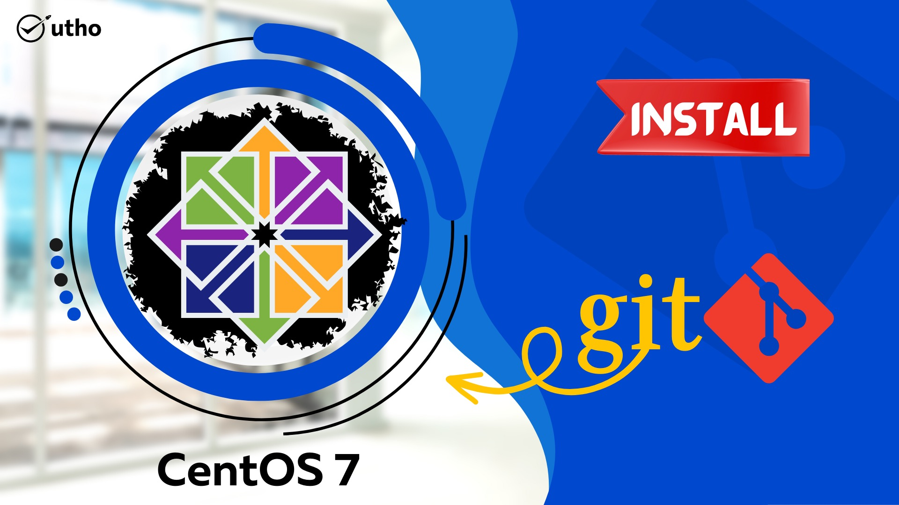

## Introduction

In this article, you will learn how to install Git on Centos 7.

[Git](https://en.wikipedia.org/wiki/Git) is a piece of software that allows for the tracking of changes in any set of files, and it is most commonly used for the purpose of coordinating work among a group of programmers who are jointly producing source code during the process of software development. Git is both free and open source. Its objectives include enhancing speed and data integrity while also providing support for dispersed and non-linear workflows (thousands of parallel branches running on different systems)

Git is a tool that can be used to monitor the history of all the changes that have been made to a project and the files that are associated with it. Git stores all of this information in a central location known as a repository. A repository is a central storage site that houses all of the files associated with a project as well as the revision histories of those files. Git is a version control system (VCS) that allows programmers working on the same project to collaborate more easily by granting them the ability to monitor changes, revert to a previous revision, and perform other similar actions.

## 1\. Install Git

To installed Git, type the following command.

```
# yum install git -y
```

Check that Git was properly installed.

```
# git --version
```

The Git version number should be displayed.

## 2\. Configure Git

Setting up your name and email address in Git is a necessary procedure.

1\. Set your name.

```
# git config --global user.name "microhost"
```

2\. Set your email address.

```
# git config --global user.email "abc@microhost.com"
```

## 3\. Verify the settings.

```
# git config --list
```

The following is an example of what you might see:

user.name=microhost

user.email=abc@microhost.com

## Conclusion

Hopefully, you have learned how to install Git Centos 7.

Also read: [How To Install MariaDB 10.7 on CentOS 7](https://utho.com/docs/tutorial/how-to-install-mariadb-10-7-on-centos-7/)

Thank You 🙂
