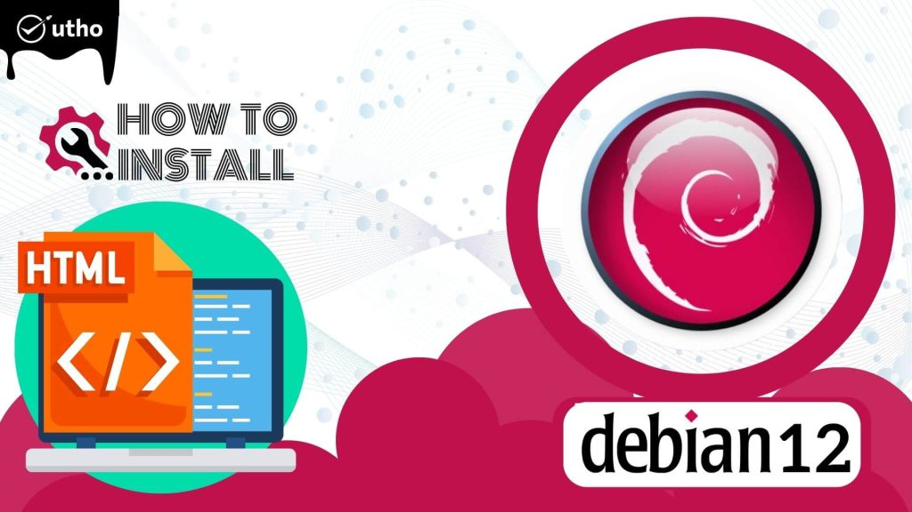

## Introduction

In this article, you will learn how to install HTMLDoc on Debian 12.

If you write your hypertext in the appropriate format, the HTMLDoc application will be able to dynamically convert it into a postscript (PDF 1.6) document (HTML 3.2). You will learn how to install HTMLDoc on Debian 10 by following the instructions in this guide.

After the HTMLDoc environment has been established, we will create a simple document consisting of only a single page and excluding any further formatting such as headers, footers, borders, or other embellishments. In its most basic form, it is an HTML template that may be scaled up or down, depending on the dimensions of the sheet of paper that will be used to print the PDF.

#### Preparing Debian 12(x64) for HTMLDoc

For the sake of this guide, the IPv4 protocol will be the only one used on the Debian 10 (x64) server. Keep in mind that this also applies to servers that only support IPv6. The first thing that should be done, given that the vast majority of Linux distributions are not configured to automatically install system updates or security patches, is to look for new versions of the programmes that are currently set up and running. In addition, it is often suggested, particularly when dealing with a new installation, to apply any necessary updates to the software and the kernel.

**Now is the time for us to figure out whether or not there are any new versions or updates for.**

```
# apt-get update

```

**Now that HTMLDoc is available, we can install:**

```
# apt-get install htmldoc -y

```

**You may now create PDF files directly from [HTML](https://en.wikipedia.org/wiki/HTML) code.**

#### Making Your First PDF Document from HTML

**Let's put this new skill through its paces from the command line. To conduct experiments, navigate to the /tmp/ folder.**

```
# cd /tmp/

```

**Now, let's begin by generating a straightforward HTML document, which we can then apply to the production of a PDF file. We may refer to it as the microhost-source html:**

```
# vi utho-source.html

```

#### Simply insert the following HTML code:

```
<html>

<head>

    <title>My first PDF from HTML</title>

</head>

<body>

    This is the body of my first PDF document made from HTML.

</body>

</html>
```

**Currently, you can save the file by typing escape:wq.**

**You can now instruct HTMLDoc to parse a PDF document from your microhost-source.html file by using the following command:**  

```
# htmldoc --webpage -f postscript-output.pdf utho-source.html

```


**You will now have a new file that has been given the name postscript-output.pdf. The title of this file will read "My first PDF from HTML," and the body of the file will have the text "This is the body of my first PDF document that was generated from HTML." Congratulations, you have successfully learnt how to convert straightforward HTML markup into documents that can be exported as PostScript or PDF files.**

## Conclusion

Hopefully, you have learned how to install HTMLDoc on Debian 12.

**Also Read:** [How to Use Iperf to Test Network Performance](https://utho.com/docs/tutorial/how-to-use-iperf-to-test-network-performance/)

Thank You 🙂
