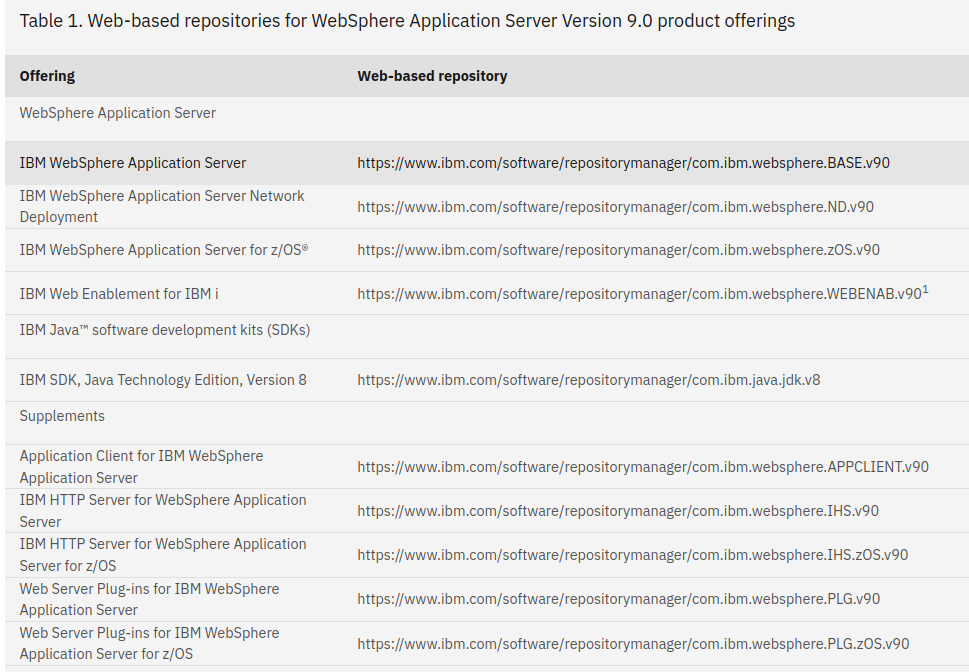
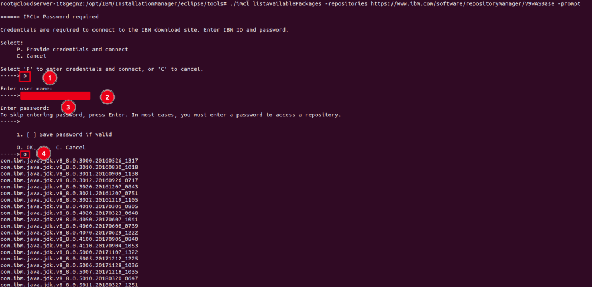

<figure>


<figcaption>

How to install IBM Http server

</figcaption>

</figure>

In this tutorial, we will learn how to install IBM http server in linux, hereafter referred to as the IHS, using command line interface. AIX®, HP-UX, Linux, Solaris, Windows, and z/OS® all work with IBM HTTP Server, Version 8.5.5. This information applies to Version 8.5.5 and all releases and changes that come after it until new editions say otherwise.

## Prerequisites

1. Need to have IBM id to install IBM WAS
2. Super User or any normal user with SUDO privileges.
3. IBM Installation Manager installed machine. You can **install IBM installation manager** using [this guide](https://utho.com/docs/tutorial/how-to-install-ibm-installation-manager/).
4. IBM WAS installed machine. You can **install IBM WAS**( Websphere Application Server) using [this guide](https://utho.com/docs/tutorial/install-ibm-websphere-application-server-in-linux/).

## Steps to install IBM

Step 1. Installation of Installation manager, creates a new directory in /opt named as IBM. Now go to this directory and list all available files

```
cd /opt/IBM/InstallationManager/eclipse/tools/
```
Step 2. Now find and save or copy either the [online BASE repository or the composite repository](https://www.ibm.com/docs/en/was/9.0.5?topic=installation-online-product-repositories-websphere-application-server-offerings) to install WAS. At this time, following are the above mentioned repositories. In this tutorial we will use composite repositories to install IBM WAS.

<figure>



<figcaption>

Repositories to install IBM WAS

</figcaption>

</figure>

Step 3. List all the available packages in the given repository. As mentioned, we will use the composite repository. And at the time of writing this tutorial, https://www.ibm.com/software/repositorymanager/V9WASBase is the composite repository.

```
./imcl listAvailablePackages -repositories https://www.ibm.com/software/repositorymanager/V9WASBase -prompt
```
Note that, here you will be asked to enter the IBM login credentials, such as email id and password. To enter the same, press ‘P’ then ‘email-id’ and then password

<figure>



<figcaption>

Lists of available packages in repo

</figcaption>

</figure>

If you are using composite repositories, you will see java jdk, websphere appClient, websphere base, websphere IHS etc. and in base repo, you will see only java jdk and websphere IHS packages.

Step 4. Now copy the name of the latest IHS and JDK package and execute the below command

```
./imcl install com.ibm.websphere.IHS.v90_9.0.5012.20220513_1431 com.ibm.java.jdk.v8_8.0.7016.20220915_1446  -repositories https://www.ibm.com/software/repositorymanager/V9WASBase -prompt -showProgress -acceptLicense
```
Step 5 Now install the best HTTP plugins. Before that, create a directory in which you will install it.

```
mkdir /opt/IBM/WebSphere/Plugins
```
```
./imcl install com.ibm.websphere.PLG.v90_9.0.5012.20220513_1431 com.ibm.java.jdk.v8_8.0.7016.20220915_1446  -repositories https://www.ibm.com/software/repositorymanager/V9WASBase -prompt -showProgress -acceptLicense -installationDirectory /opt/IBM/WebSphere/Plugins
```
Step 6. After installing plugins, client can make necessary changes in http configuration file( In IBM http server, config file exists as- /opt/IBM/HTTPServer/conf/httpd.conf) to enable the http plugins

Step 7. You can check the right installation of http server by 

```
cd /opt/IBM/HTTPServer/bin
```
```
./apachectl start // and to stop, use ./apachectl stop
```
Now go to browser and hit your server IP. You will see something like this.

<figure>


<figcaption>

Successfull installation of IBM HTTP server

</figcaption>

</figure>

And this is how you will install IBM Http server in linux using command line interface.
