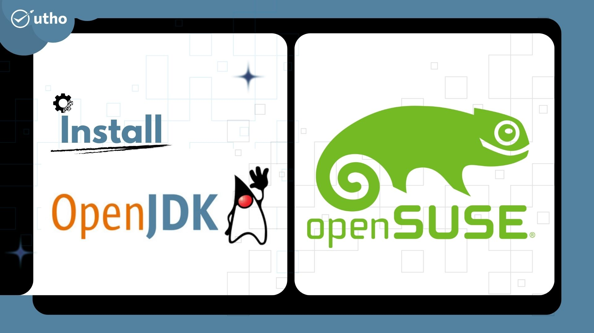
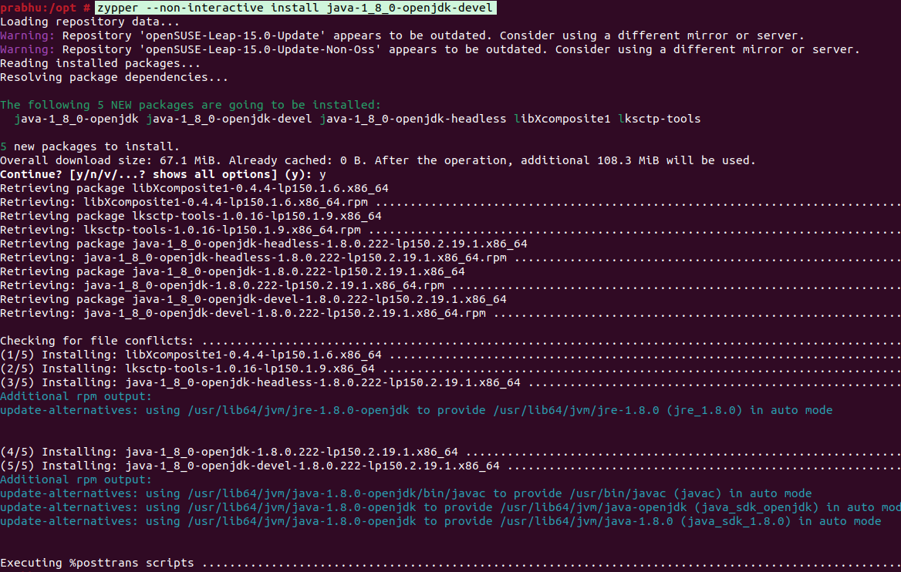

<figure>



<figcaption>

How to install JAVA JDK on OpenSUSE

</figcaption>

</figure>

In this article, you will learn how to install Java JDK on OpenSUSE. [The Java Development Kit](https://www.google.com/url?sa=t&rct=j&q=&esrc=s&source=web&cd=&cad=rja&uact=8&ved=2ahUKEwi3x5X1lNP_AhWXRmwGHa71DUAQFnoECDAQAQ&url=https%3A%2F%2Fen.wikipedia.org%2Fwiki%2FJava_Development_Kit&usg=AOvVaw2JxP3C7IQqM_S6YcfWte96&opi=89978449) is a distribution of Java Technology by Oracle Corporation. It implements the Java Language Specification and the Java Virtual Machine Specification and provides the Standard Edition of the Java Application Programming Interface. You can also have you first Cloud on [Utho Cloud.](http://utho.com)

## Prerequisites

- Super user or any normal user with SUDO privileges.

- Internet enabled on server.

## Steps to install Java on OpenSUSE.

Step 1: First refresh the Zypper repolist on your server.

```
zypper refresh
```
<figure>


<figcaption>

Search for packet OpenJDK

</figcaption>

</figure>

Step 2: Search for the available OpenJDK version available on your server.

```
zypper search openjdk-devel
```
Step 3: Now, Install the desired version of java on your server. Here, in this example, we have installed OpenJDK 8.

```
zypper --non-interactive install java-1_8_0-openjdk-devel
```
<figure>



<figcaption>

Installing OpenJDK on OpenSUSE

</figcaption>

</figure>

Thanks You !!!
