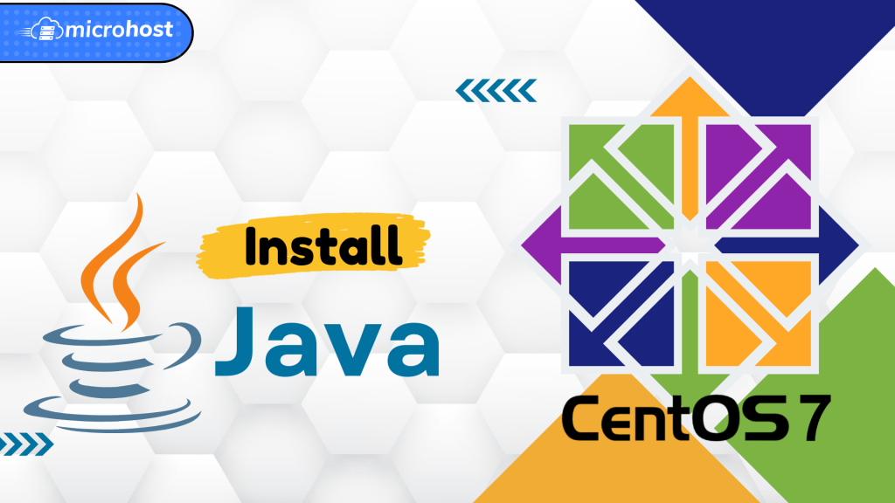
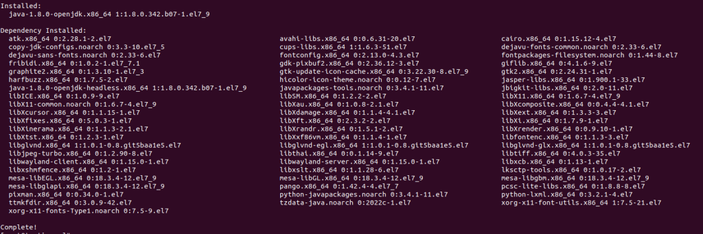

## Introduction

In this Article you will know How to Install Java on CentOS Server. Red Hat Enterprise Linux, CentOS, Fedora, and Rocky Linux are all types of Linux. Java is a popular programming language and software platform that lets you run many applications that run on the server.

## Prerequisites

- Any super user( root ) or any normal user with SUDO privileges
- yum repository configured server

## 1 – Installing OpenJDK

The Java Platform comes in three different versions: Standard Edition (SE), Enterprise Edition (EE), and Micro Edition (ME). This guide is all about Java SE (Java Platform, Standard Edition). Almost all Java software that is free and open source is made to work with Java SE.

The Java Runtime Environment (JRE) and the Java Development Kit (JDK) are both Java SE packages that can be installed (JDK). JRE is a version of the Java Virtual Machine (JVM), which lets you run Java programmes and applets that have already been built. The JDK comes with the JRE and other software needed to write, develop, and compile Java programmes and applets.

Java can also be run in two different ways: OpenJDK and Oracle Java. Both implementations are mostly based on the same code, but OpenJDK, which is the reference implementation of Java, is completely open source while Oracle Java has some code that is only available to Oracle. Most Java programmes will work fine with either implementation, but you should use the one that your software needs.

Java can be installed in different versions and releases, but most people only need one installation. So, try to only install the version of Java you need to run or build your app (s).

This section will show you how to install the prebuilt OpenJDK JRE and JDK packages using the `yum` package manager.

To install the OpenJDK using yum, you can run yum install java

```
yum install java
```
If you don't specify a version when you try to install Java, the most common stable version of the OpenJDK JRE will be used. aAs you can see from this output, that is java-1.8.0-openjdk as of this writing.

<figure>



<figcaption>

Installed java on Fedora server

</figcaption>

</figure>

You should now have a Java setup that works. To make sure, run java -version to see what version of Java is currently installed in your environment:

```
java -version
```
<figure>


<figcaption>

Current version of Java

</figcaption>

</figure>

To install the full OpenJDK JDK, you need to install the package with the name -devel added to it. Java follows this common practise for development packages for other programming environments.

```
yum install java-devel
```
<figure>


<figcaption>

Package size to install java

</figcaption>

</figure>

## 2- Installing Other OpenJDK Releases

[OpenJDK](https://en.wikipedia.org/wiki/OpenJDK) has changed the way it numbers its versions so that they are more in line with Oracle Java releases. Like with 1.8.0, you can put the version number in the package name to install a newer version of OpenJDK. To install OpenJDK 17, for example, you can type yum install java-17-openjdk:

```
yum install java-11-openjdk-devel
```
## 3- Setting Your Default Java Version

If you have more than one version of Java installed, you may want to make one the default (i.e. the one that will run when a user runs the java command). Also, some programmes need certain environment variables to be set in order to find out which version of Java to use.

The default Java version can be set by using the alternatives command, which uses symbolic links to manage the default commands. Use alternatives –config java: to see a list of the versions of Java that alternatives can handle.

```
alternatives --config java
```
<figure>


<figcaption>

Alternatives of java version

</figcaption>

</figure>

Enter the number of the a selection to choose which Java executable to use by default. It will change the symbolic links on your system so that the java command points to the right set of libraries. You can run this command as many times as you want, and each time the output of java -version should change:

```
java -version
```
<figure>


<figcaption>

Latest version of java

</figcaption>

</figure>

Hopefully now you can Install Java on CentOS server.

**Must Read :** [How to install Gradle on CentOS 7](https://utho.com/docs/tutorial/how-to-install-gradle-on-centos-7/)
