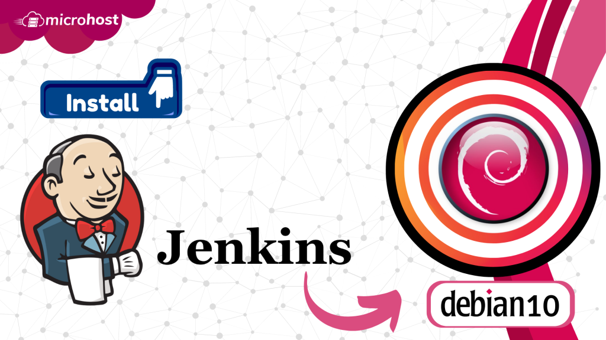

<figure>



<figcaption>

How to install Jenkins on Debian 10

</figcaption>

</figure>

Learn how to install [Jenkins](https://www.jenkins.io/) on Debian 10 in this post. Jenkins is a software platform that supports both Continuous Delivery (CD) and Continuous Integration (CI) (CD). It is used to automate software testing, development, delivery, and deployment. Ubuntu's Jenkins software generates a powerful management tool that enhances the development process.

## Prerequisites:

- A Debian 10 or Debian 11 installed server
- A super user( root) or any user with SUDO privileges.

## 1: Install Java:

Java Runtime Environment is necessary for Jenkins (JRE). For the Java environment, OpenJDK is used in this manual. The Java Runtime Environment is part of the development kit known as OpenJDK. Java may be installed in many versions on Ubuntu. Make sure Java 8 or Java 11 is specified as the default version if you decide to do this.

Step 1.1 Verify that Java is already installed on your Ubuntu system.

```
java -version
```
<figure>


<figcaption>

Java binary not found

</figcaption>

</figure>

Since Java isn't already installed on our PC, we'll use OpenJDK to do it.

```
info !
```
Step 2 may be skipped if Java is already installed on your Ubuntu system


Step 1.2: Open a terminal window first, then execute the following command to update the system package repository:

```
apt update
```
Step 1.3: Run one of the following instructions depending on whether Java 8 or 11 is the version you wish to instal:

```
apt install openjdk-8-jdk -y
```
or

```
apt install openjdk-11-jdk -y
```
## 2: Add the Jenkins Repository and install Jenkins

Step 2.1: By importing and applying the GPG keys to the system, Jenkins may be quickly deployed on Ubuntu.

```
curl -fsSL https://pkg.jenkins.io/debian-stable/jenkins.io-2023.key | sudo tee  /usr/share/keyrings/jenkins-keyring.asc > /dev/null
```
Step 2.2: After adding GPG keys, use the following command to add the Jenkins package URL to the sources list:

```
echo deb [signed-by=/usr/share/keyrings/jenkins-keyring.asc]  https://pkg.jenkins.io/debian-stable binary/ | sudo tee \
```  /etc/apt/sources.list.d/jenkins.list > /dev/null
```

Step 2.3: The system's APT cache only has to be updated once when the Jenkins repository has been enabled.

```
apt update
```
Step 2.4: Let's proceed and instal Jenkins in its entirety.

```
apt install jenkins -y
```
## 3\. Start the Jenkins services

Step 3.1: When Jenkins is installed, the service ought to start automatically. Type the command shown below to check the status of the Jenkins service.

```
systemctl status jenkins
```
Step 3.2: In my instance, it is active; however, if it is not in your case, start by running the following command:

```
systemctl enable --now jenkins
```
## 4\. Setup you Jenkins

Step 4.1: When you enter your domain name or IP address and port 8080 into your browser's address bar to set up Jenkins, the Unlock Jenkins screen that prompts for a password should appear, as illustrated in the example below.

<figure>


<figcaption>

Homepage of Jenkins

</figcaption>

</figure>

Step 4.2: Using the cat command on the terminal, you may get the password from the specified place. The following would be the command to get the password:

```
cat /var/lib/jenkins/secrets/initialAdminPassword
```
In this article, we have learnt how to install Jenkins on debian 10 using OpenJDK 8 and OpenJDK 11.

Also Read: [How to install Tomcat 10 on Ubuntu server](https://utho.com/docs/tutorial/how-to-install-tomcat-on-ubuntu/), [How To Install Java on Fedora server](https://utho.com/docs/tutorial/how-to-install-java-on-fedora-server/)
