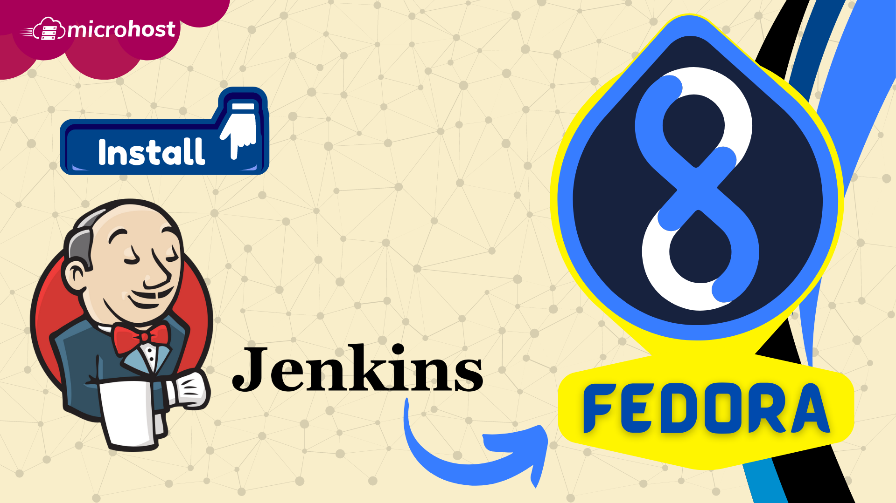
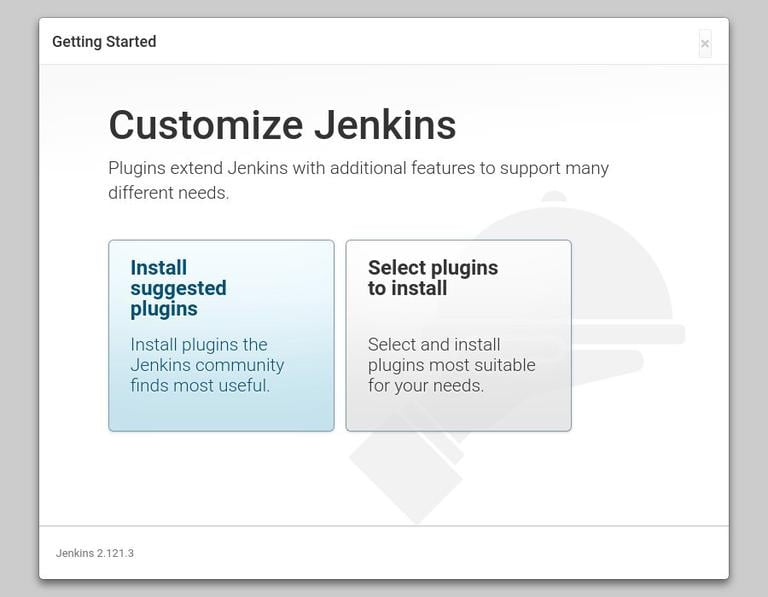
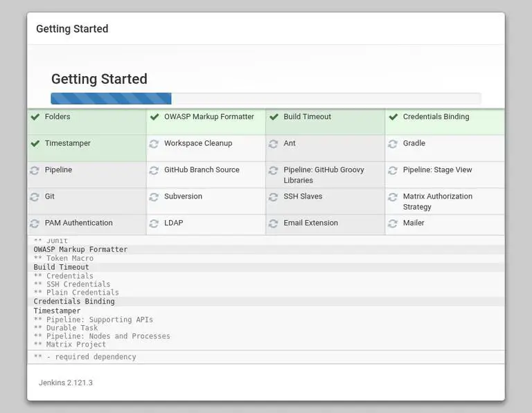
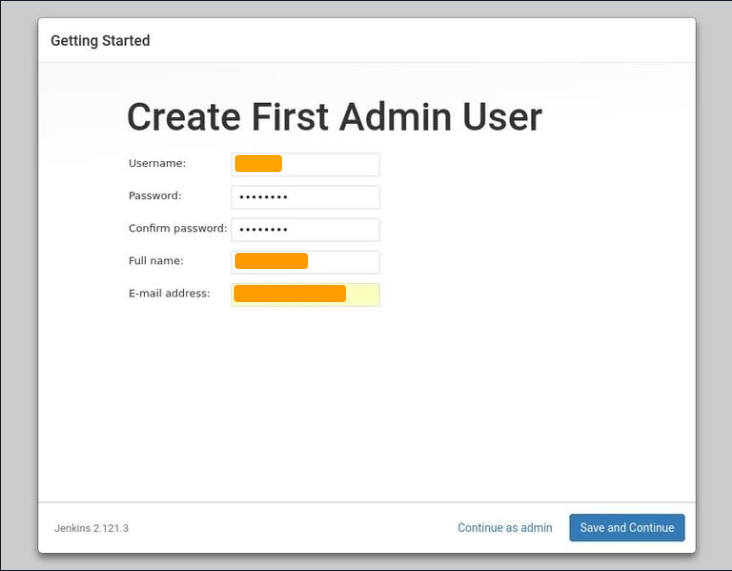
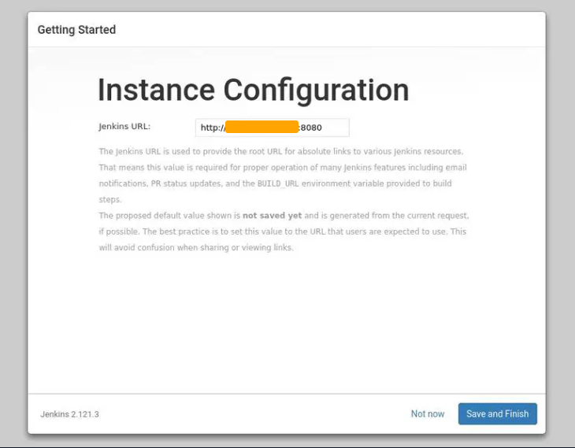
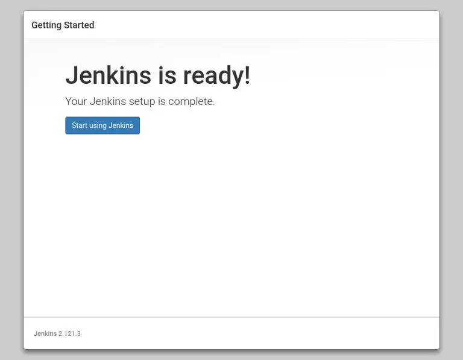

<figure>



<figcaption>

How to install Jenkins on Fedora

</figcaption>

</figure>

You will learn how to install Jenkins on Fedora server or on RHEL 7/8/9 in this article. Jenkins is a software platform that supports both Continuous Delivery (CD) and Continuous Integration (CI). It is used to automate software testing, development, delivery, and deployment. Ubuntu's Jenkins software generates a powerful management tool that enhances the development process.

## Prerequisites:

- A super user or any normal user with SUDO privileges

- Yum repository configured Fedora server

## 1: Install OpenJDK 8 package on Fedora

J[ava Runtime Environment](https://www.javatpoint.com/java-jre) is necessary for Jenkins (JRE). For the Java environment, OpenJDK is used in this manual. The Java Runtime Environment is part of the development kit known as OpenJDK. Java may be installed in many versions on Ubuntu. Make sure Java 8 or Java 11 is specified as the default version if you decide to do this. For more information on how to install JDK on Fedora server, you can [refer this.](https://utho.com/docs/tutorial/how-to-install-java-on-fedora-based-linux/)

Step 1.1: Verify that Java is already installed on your Fedora server

```
java -version
```
<figure>


<figcaption>

Java binary not found

</figcaption>

</figure>

Since Java isn't already installed on our PC, we'll use OpenJDK to do it.

Info! Step 2 may be skipped if Java is already installed on your Ubuntu system

## 2\. Install Jenkins repository

Step 2.1: The next step is to turn on the repository for Jenkins. To do this, use the following curl command to bring in the GPG key:

```
curl --silent --location http://pkg.jenkins-ci.org/redhat-stable/jenkins.repo | sudo tee /etc/yum.repos.d/jenkins.repo
```
And here's how to add the repository to your system:

```
rpm --import https://jenkins-ci.org/redhat/jenkins-ci.org.key
```
Step 2.2: And here's how to add the repository to your system: Once the repository is turned on, type: yum install latest stable Jenkins to install it.

```
yum install jenkins
```
Once the installation is done, you can start the Jenkins service by:

```
systemctl enable --now jenkins
```
## 3\. Adjust the Firewall 

Step 3.1: You need to port 8080 if you are installing Jenkins on a remote Fedora server that is protected by a firewall.  
Use these commands to open the port you need:

```
firewall-cmd --permanent --zone=public --add-port=8080/tcp
firewall-cmd --reload
```
## 4\. Setting Up Jenkins 

Open your browser and type your domain or IP address followed by port 8080 to set up your new Jenkins installation:

```
http://your_ip_or_domain:8080
```
You will see a screen like the one below, which will ask you to enter the Administrator password that was made during the installation:

<figure>


<figcaption>

Homepage of Jenkins after installation

</figcaption>

</figure>

Use the following command to get your terminal to show the password:

```
cat /var/lib/jenkins/secrets/initialAdminPassword
```
You should see an alphanumeric password with 32 characters.

```
9836b548f4e99a203ee98s68232a32
```

Copy the password from your terminal, paste it into the Administrator password field, and then click Continue.

<figure>



<figcaption>

Next step of installation

</figcaption>

</figure>

On the next screen, you'll be asked if you want to install the recommended plugins or choose your own. If you click on the box that says Install suggested plugins, the process of installing them will start right away.

<figure>



<figcaption>

Installing required packages

</figcaption>

</figure>

After the installation is done, you will be asked to set up the first administrative user. Fill in all the required information and click Save and Continue.

<figure>



<figcaption>

First Admin user created

</figcaption>

</figure>

You will be asked to set the URL for the Jenkins instance on the next page. A URL will be automatically made and put in the URL field.

<figure>



<figcaption>

Final step of installing

</figcaption>

</figure>

To finish setting up, click the Save and Finish button to confirm the URL.

<figure>



<figcaption>

Installed Jenkins

</figcaption>

</figure>

Lastly, click on the button that says "Start using Jenkins." This will take you to the Jenkins dashboard, where you can log in as the admin user you made in one of the earlier steps.

If you’ve reached this point, you’ve successfully installed Jenkins on your Fedora system.
