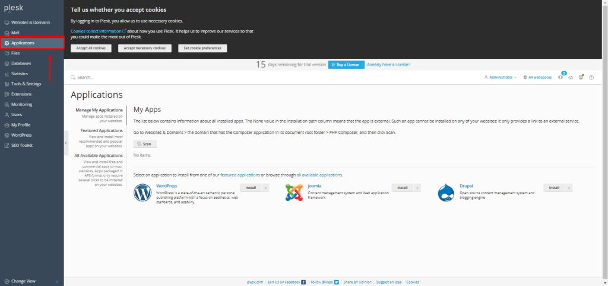
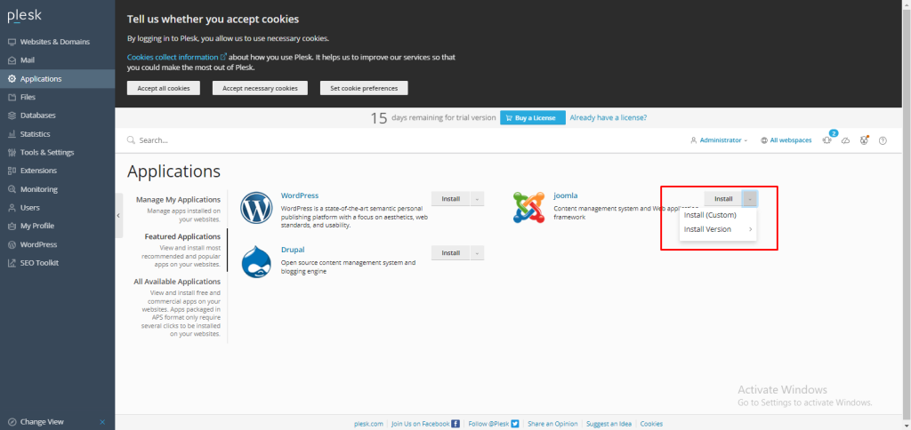

## Introduction

In this article, you will learn how to install Joomla in Plesk.

Joomla, often known as Joomla! and frequently abbreviated as J!, is a free and open-source content management system. Joomla is a platform for publishing online content on websites. Web content applications are made up of a broad range of web-based programmers. Online user communities, online photo galleries, online discussion forums, and online commerce are some instances of these programmers.

Step 1. Log into your [Plesk](https://en.wikipedia.org/wiki/Plesk) with your server password by searching server\_ip:8880 in your browser.

Step 2. Go to the applications option, which is on the left side of the screen.

Step 3. Click on the arrow to the right of install and you will be given two options for installing Joomla: one for custom installation and the other for Joomla versions. 

Step 4. Pick the alternative that best suits your needs, and then start the installation.

Step 5. You have successfully installed Joomla.

## Conclusion

Hopefully, now you have learned how to install Joomla in Plesk.

Also read: [How to install WordPress in Plesk](https://utho.com/docs/tutorial/how-to-install-wordpress-in-plesk/)

Thank You 🙂
