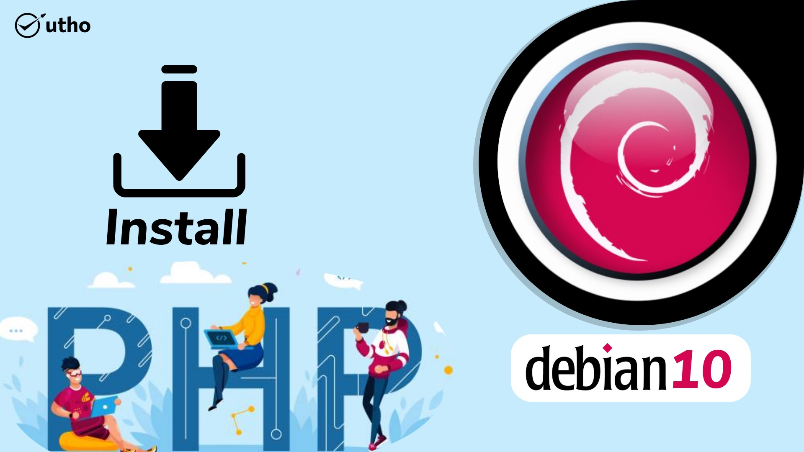

## Introduction

[PHP](https://en.wikipedia.org/wiki/PHP) is the most widely used server-side scripting language in creation of dynamic web pages. PHP applications usually work well with HTML and interact with relation database management systems, here are the steps to Install PHP 7.4 on Debian 10.

PHP is an open-source server-side programming language that may be used to construct a wide range of various things, such as websites, applications, and customer relationship management systems. PHP is a server-side programming language. It is a programming language that may be used for a variety of purposes and is rather popular. Additionally, it can be included into HTML. Because PHP can work with HTML, it has remained one of the most widely used programming languages in the development community. This is due to the fact that PHP contributes to the simplification of the HTML code.

The phrase "PHP: Hypertext Preprocessor" is what the acronym PHP refers to, with the "PHP" in PHP initially standing for "Personal Home Page" inside this abbreviation. Since its creation in 1994, the phrase has gone through a number of modifications in order to provide a more accurate description of the nature of the entity to which it refers.

For nearly three decades, PHP has been a go-to language for web development thanks to its many features and flexibility.

## Step 1: Update system

```
# apt update -y
```

```
# apt upgrade -y
```

## Step 2: Add SURY PHP PPA repository

```
# apt -y install lsb-release apt-transport-https ca-certificates
```

```
# wget -O /etc/apt/trusted.gpg.d/php.gpg https://packages.sury.org/php/apt.gpg
```


## Step 3: Install PHP 7.4

Install PHP 7.4 on Debian 10 as the last step in the process. Before beginning the installation process, the system package list ought to be brought up to date on any recently added repositories.

```
# apt list --upgradable
```

```
# apt install php7.4 -y
```

Run the following command to find out which version of PHP is currently set up on your server:

```
# apt install php7.4
```


Also read: [How To Install PHP 7.4 on Fedora 36/35/34/33/32/31](https://utho.com/docs/tutorial/how-to-install-php-7-4-on-fedora-36-35-34-33-32-31/)

Thank You 🙂
