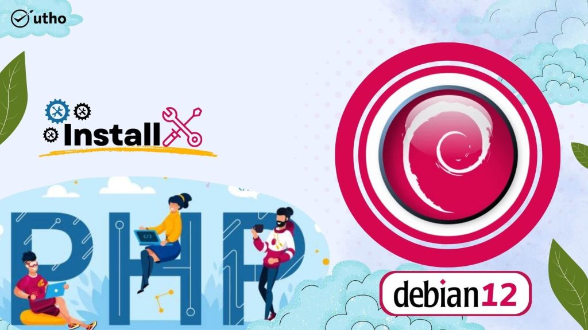

## Introduction

In this article, you will learn how to install PHP 7.4 on Debian 12.

[PHP](https://en.wikipedia.org/wiki/PHP) is the most widely used server-side scripting language in creation of dynamic web pages. PHP applications usually work well with HTML and interact with relation database management systems, here are the steps to Install PHP 7.4 on Debian 12.

PHP is an open-source server-side programming language that may be used to construct a wide range of various things, such as websites, applications, and customer relationship management systems. PHP is a server-side programming language. It is a programming language that may be used for a variety of purposes and is rather popular. Additionally, it can be included into HTML. Because PHP can work with HTML, it has remained one of the most widely used programming languages in the development community. This is due to the fact that PHP contributes to the simplification of the HTML code.

The phrase "PHP: Hypertext Preprocessor" is what the acronym PHP refers to, with the "PHP" in PHP initially standing for "Personal Home Page" inside this abbreviation. Since its creation in 1994, the phrase has gone through a number of modifications in order to provide a more accurate description of the nature of the entity to which it refers.

For nearly three decades, PHP has been a go-to language for web development thanks to its many features and flexibility.

**Before you move on, it's important to make sure your system has the latest security changes and software updates. Follow these instructions:**

```
# apt update -y

```

```
# apt upgrade -y

```

**There are PHP 8.2 and PHP 7.4 packages in the usual Debian 12 repositories, but not PHP 8.1, 7.3, 7.2, or 5.6. So, we suggest adding Ondej Sur's PHP library, which has up-to-date PHP packages from a third party. To add the folder, run the following commands:**

```
# apt install -y apt-transport-https lsb-release ca-certificates wget

```

```
# wget -O /etc/apt/trusted.gpg.d/php.gpg https://packages.sury.org/php/apt.gpg

```


```
# echo "deb https://packages.sury.org/php/ $(lsb\_release -sc) main" | tee /etc/apt/sources.list.d/php.list

```

**Then update the system to match the new repository.**

```
# apt update -y

```

**Installing PHP 7.4 on Debian 12**

```
# apt install -y php7.4

```

**Using the same way as above, you can check the installation:**

```
# php -v

```


## Conclusion

Hopefully, now you have learned how to install PHP 7.4 on Debian 12.

**Also Read:** [How to Use Iperf to Test Network Performance](https://utho.com/docs/tutorial/how-to-use-iperf-to-test-network-performance/)

Thank You 🙂
