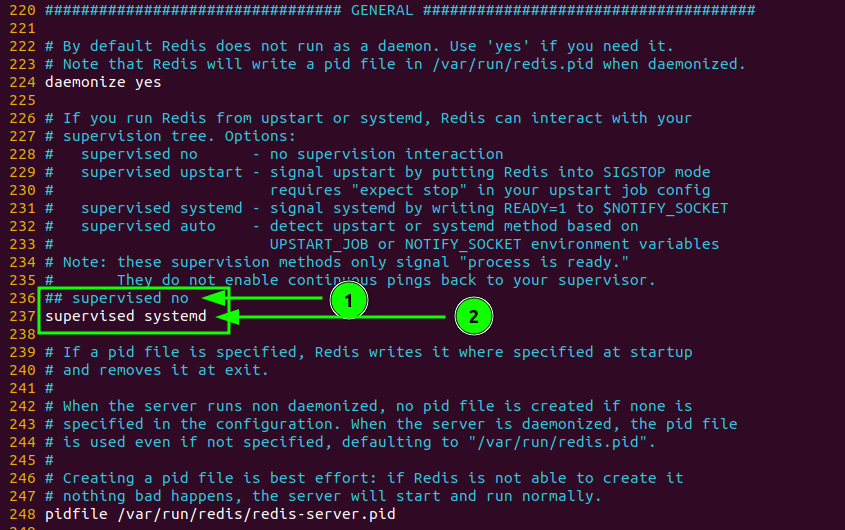

<figure>


<figcaption>

How to install Redis on Ubuntu

</figcaption>

</figure>

In this article you will learn How to install Redis cache on Ubuntu.

Redis cache is one of the most widely used caching solutions for accelerating WordPress websites. It is open source like WordPress, making it a wonderful option to [use alongside WordPress](https://utho.com/docs/tutorial/how-to-install-wordpress-with-lemp-on-ubuntu/) and not only Wordpress but for your application which uses databases..

However, if you are unfamiliar with caching in general, it can be difficult to comprehend what Redis is and how Redis cache operates.

Redis cache is widely used because it supports nearly all main programming languages. In addition, like WordPress, it is open source, which means it is a well-supported system that is a cost-effective method to speed up your website or application.

Despite the fact that Redis cache is predominantly used as a caching system to speed up WordPress websites, Redis itself is far more potent. Redis can also be used as a database and a message broker, but the focus of this article will be on its caching capabilities.Redis cache excels when used as an object caching utility for WordPress websites. Since WordPress is such a potent and versatile Content Management System, it contains a large number of frequently accessed data objects.

## [Prerequisites](https://www.digitalocean.com/community/tutorials/how-to-install-and-secure-redis-on-ubuntu-18-04#prerequisites)

- A super user or any other user with SUDO privileges
- Updated Ubuntu 22.04 or Ubuntu 20.04 system with apt repositories ready to install packages

## Steps to install redis on Ubuntu

Step 1: If you haven't done so in a while, update your local apt package cache:

```
apt-get update
```
Step 2: Now, install Redis using apt utility

```
apt-get install redis-server
```
This will get Redis and all of its components and install them. After that, you need to make one important change to the Redis setup file, which was automatically made during startup.

Step 3: Change the supervised value to systemd

```
vi /etc/redis/redis.conf
```

Find the supervised keyword in the file. With this command, you can tell an init system to take care of Redis as a service. This gives you more control over how it works. By default, the supervised command is set to "no." Since you are using Ubuntu, which uses the systemd init system, change this to systemd

<figure>



<figcaption>

change the init system to systemd of Redis

</figcaption>

</figure>

At this point, that is the only change you need to make to the Redis configuration file. Save and close the file when you are done. Then, restart the Redis service to make the changes to the settings file take effect:

Stem 4: Now, restart the redis service

```
systemctl restart redis
```
## 2\. Test the Redis setup

Before making any more changes to Redis's setup, it's a good idea to make sure it works as planned, just like you should do with any new software. In this step, we will talk about a number of ways to make sure Redis is working properly.

Step 1: First, make sure the Redis service is up and running: use the command-line client to connect to the server:

```
redis-cli
```
Step 2: [Use the ping command](https://learn.microsoft.com/en-us/windows-server/administration/windows-commands/ping) at the next window to see if you can connect.

```
ping
```
<figure>


<figcaption>

Connectivity to redis server

</figcaption>

</figure>

Step 3: This result shows that the link to the server is still alive. Next, make sure you can set keys by typing:

```
set msg "Congratulations, It's working !"
```

Step 4: Retrieve the value by typing:

```
get msg
```
<figure>


<figcaption>

able to set key value in redis

</figcaption>

</figure>
