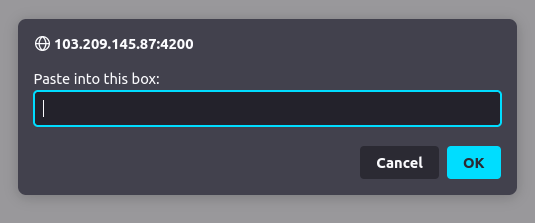

Before installing Shellinabox on Fedora server to use the browser to access the [Fedora](https://utho.com/docs/tutorial/how-to-set-manual-or-static-ip-address-on-fedora/) terminal, we need to figure out how to do that. Markus Gutschke made Shell in a Box, and its name is pronounced "shellin' box." It is a web-based programme that acts like a terminal. It gives you a web terminal emulator that lets you access and control your Linux Server SSH Shell remotely from any browser that supports [AJAX](https://en.wikipedia.org/wiki/Ajax_(programming))/JavaScript and CSS, without the need for additional browser plugins like FireSSH. It has a web server built in that works as a web-based SSH client on a certain port. This web server also works as an SSH client that runs on the web.

In this article, we'll talk about how to install Shellinabox and connect to a remote SSH terminal using any modern web browser. Any system can use Shellinabox. When you are behind a firewall and can only let HTTP(s) traffic through, Web-based SSH is a very useful tool.

## Overview:

Shellinabox is included by default on many Linux distributions, such as Debian, Ubuntu, and Linux Mint, through their default repositories. But in Fedora we need to install extra repository for enterprises Linux.

## Prerequisites:

- Super user( root) or any normal user with SUDO privileges.
- DNF or package repositories enabled and available to install packages.

## 1- Installation

To install the Shellinabox on your Fedora server, first install the epel-repolistory on it. To do so, use the below command.

```
dnf install epel-release -y
```
And now you can install the shellinabox on your machine.

```
dnf install shellinabox -y
systemctl start shellinaboxd
systemctl enable shellinaboxd
```
## Configure Shellinabox

ou will find the configuration file has a different name and directory in which it is present as you go from one Linux flavor to another. In Fedora the configuration file can be found as- /etc/sysconfig/shellinaboxd

```
vi /etc/sysconfig/shellinaboxd
```
<figure>


<figcaption>

content of /etc/sysconfig/shellinaboxd

</figcaption>

</figure>

Make sure to have the SSH option in the OPTS entry in the configuration file.

## Points to remember:

- For security reasons, we should change the default port number of shellinabox service.
- Make sure to enable the shellinabox port in your firewall( if you are using one)

## Verify the port and running status of Shellinabox

```
netstat -tunlp | grep shellinaboxd
```
```

tcp    0     0 0.0.0.0:4200     0.0.0.0:*         LISTEN  1908/shellinaboxd
```

Now, open your web browser and go to https://Your-IP-Address:4200. You should be able to see an SSH terminal that runs on the web. When you log in with your username and password, you should see your shell prompt.

<figure>


<figcaption>

Browser's first page

</figcaption>

</figure>

Now, when you do just as mentioned in above step, you will be asked to go advanced and proceed to your serverip. After proceeding further, you will see a blank screen asking for the login password.

Enter here, your login username and password to continue using your terminal in browser.

<figure>


<figcaption>

security page of browser

</figcaption>

</figure>

After this, you will see a blank white screen prompt which will ask you the username similar to which you see on your ssh prompt. Here, enter the username, from which you want to login. After username it will ask you the password.

For entering the password, you can enter it either by typing manually or just right click on your browser screen and select 'Paste from browser' and paste the password on the next windows.

<figure>


<figcaption>

To paste password on your browser

</figcaption>

</figure>

After entering the password on the below like screen, either press enter or click on 'ok'

<figure>



<figcaption>

click 'ok' to paste the content

</figcaption>

</figure>

After successfully loging in to your server, you can use your browser same as you use your ssh login.

<figure>


<figcaption>

login prompt of the server

</figcaption>

</figure>

And that is it, you have installed the Shellinabox on your Fedora server
