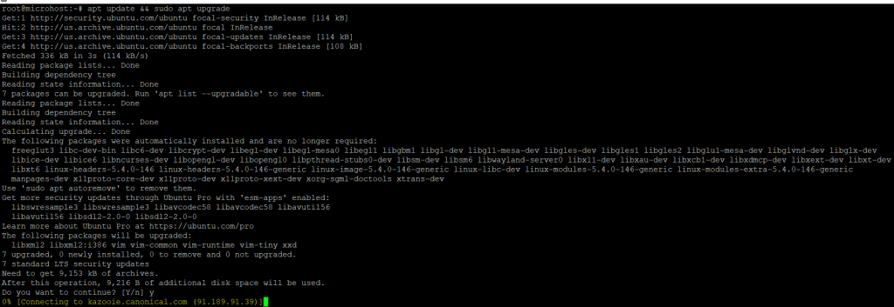

**Description**

In this article, we will acquire new knowledge how to Install tree command on [Ubuntu](https://en.wikipedia.org/wiki/Ubuntu) 20.04

Tree is a free and open-source command-line programme for recursively listing directory contents in a depth-indented format. It enables us to view all files and directories recursively without entering the specified path.

This makes it sometimes very convenient for developers and programmers to view all project files and their paths using a simple command-line terminal utility instead of an integrated development environment (IDE). Clearly, this eliminates the need to install an IDE on the system. The tree utility is also very simple to install on nearly all Linux and Unix systems. Here are the instructions for installing the tree utility on [Ubuntu](https://utho.com/docs/tutorial/how-to-install-gawk-on-ubuntu-20-04/) 20.04 LTS-based machines. Explore information about the tree command.

Follow the below steps to How to Install tree command on Ubuntu 20.04

## Step 1: Update Server

first running sudo apt update, and then upgrading packages to the newest version by running sudo apt upgrade, as demonstrated below.

```
apt update && sudo apt upgrade
```


## Step 2: Install command

Depending on your needs and tool availability, you can install Tree Command on your system.

Install the tree package from the default Ubuntu repository, and then execute sudo apt-get install tree as demonstrated below.

```
apt install tree
```


## Step 3: Verify Installation

If you loaded the tree utility from the default Ubuntu repository, you can use the dpkg -L tree command, as shown below, to check the installed file path.

```
dpkg -L tree
```


## Step 4: Check Version

Using the tree --version command, as shown below, you can determine the current installed version.

```
tree --version
```


## Step 5: Use of tree command

We can test it by using the tree microhost command to show a list of all the files and folders in the microhost directory, as shown below. The results that are put underlined can be seen in the output. Tree will show all the files in the current working directory if you don't give it any other information. You can use the tree --help command to see all of the choices that the tree utility has.


## Step 6: remove tree command

Depending on how you installed the tree command, you can also use one of the ways below to remove it from your system when you're done using it.

```
apt remove tree
```


I hope you carefully followed all of the steps to how to Install tree command on Ubuntu 20.04 and please read the article below as well.

Must Read :- [https://utho.com/docs/tutorial/how-to-install-gawk-on-ubuntu-20-04/](https://utho.com/docs/tutorial/how-to-install-gawk-on-ubuntu-20-04/)
