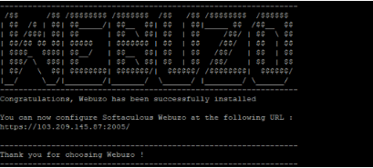

## Introduction

In this article, you will learn how to install Webuzo on Fedora.

Webuzo is a control panel for multi-user shared hosting that enables users to simultaneously deploy a variety of apps and share server resources with other users. This is made possible by Webuzo's multi-user shared hosting model. You will gain the knowledge necessary to install Webuzo on Fedora by reading this post. Webuzo is a control panel for shared hosting that supports many users. Even if the user has no prior experience with or knowledge of technical administration, they are still able to install applications, manage domains, schedule jobs, build databases, and manage users thanks to the control panel's interactive management interface. This makes it possible for users to install applications, manage domains, schedule jobs, build databases, and manage users. This is due to the fact that the control panel is used to carry out activities such as the development of databases, the scheduling of jobs, the management of domains, and the installation of applications. This is made possible by the fact that it is able to execute all of these things, which in turn makes it possible to complete all of these things through the control panel.

Within the context of this tutorial, we will discuss how to install Webuzo on a server that has recently been set up using Fedora.

##### Step 1. Update the Server.

```
# yum update -y
```

##### Step 2: To download the Webuzo installer, use the following command.

```
# wget -N [http://files.webuzo.com/install.sh](http://files.webuzo.com/install.sh)
```

##### Step 3: Make sure that the installer.sh file has the Execute permission.

```
# chmod 700 install.sh
```

##### Step 4: Begin the process of installing Webuzo by executing the script that is located within the directory.

```
# ./install.sh
```



##### Step 5: Navigate to the location of your server that is listening on port 2004 using a web browser.

```
http://SERVER-IP:2004
```


## Conclusion

Congratulations, Webuzo has been successfully installed on a server running [Fedora](https://utho.com/docs/tutorial/how-to-setup-sftp-user-account-on-fedora/) . Build shared hosting packages on a single server with the help of this control panel, and set up web applications that can be accessed by several users at the same time.

Hopefully, you have learned how to install Webuzo on Fedora.

Thank You 🙂
