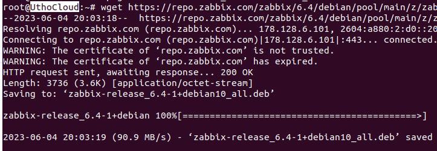
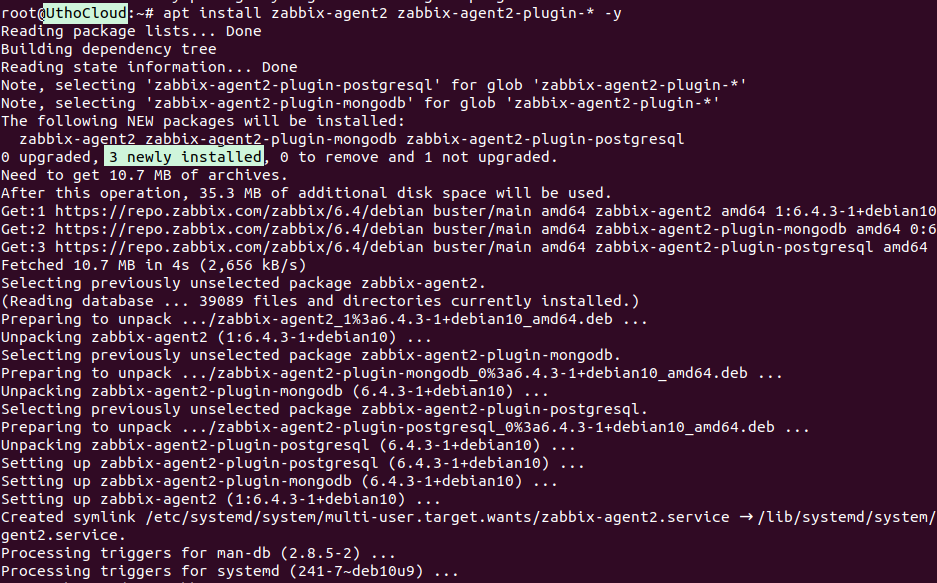

<figure>


<figcaption>

How to install Zabbix agent on Debia

</figcaption>

</figure>

```
Introduction
```
In this article, you will learn how to install Zabbix agent on Debian 10. When a native Zabbix agent is built in the [C programming language](https://www.google.com/url?sa=t&rct=j&q=&esrc=s&source=web&cd=&cad=rja&uact=8&ved=2ahUKEwiPwYa0jdP_AhWlcWwGHdD2CxcQFnoECA8QAQ&url=https%3A%2F%2Fen.wikipedia.org%2Fwiki%2FC_(programming_language)&usg=AOvVaw3vI8WzyDIw4n3m42_eXFeI&opi=89978449), it has the capability of running on a variety of supported platforms, such as Linux, UNIX, and Windows, and collecting data from a device about its CPU consumption, memory usage, disc usage, and network interface usage.This is the Zabbix agent, and it collects all data by using the agent's configuration file. So let's get started with this instruction for step by step, shall we?

## Prerequisites

- apt repolist configured to install the new packages.

- Super user or any normal user with SUDO privileges to install packages.

## Steps to install Zabbix agent on Debian server

Step 1: First and foremost you need to update you Debian server to install the secure patches. In my case, it happened that before installing zabbix-agent we were facing certificate errors in installing the zabbix agent. So after fully updaing the server, we were able to install the zabbix agent successfully. If you are looking for install Zabbix server on CentOS, you can [check here](https://www.google.com/url?sa=t&rct=j&q=&esrc=s&source=web&cd=&cad=rja&uact=8&ved=2ahUKEwjuxtOgjtP_AhVva2wGHQ_rA504ChAWegQICRAB&url=https%3A%2F%2Futho.com%2Fdocs%2Ftutorial%2Fhow-to-install-zabbix-agent-on-centos-7%2F&usg=AOvVaw3O22_VJjErmgylQImDdCbG&opi=89978449)

```
apt-get update
apt-get upgrade
```
Step 2: Now, download the package which will install the Zabbix agent 6 on your server.

```
wget https://repo.zabbix.com/zabbix/6.4/debian/pool/main/z/zabbix-release/zabbix-release_6.4-1+debian10_all.deb --no-check-certificate
```

<figure>



<figcaption>

Download the Zabbix agent repository

</figcaption>

</figure>

Step 3: Install the Zabbix repolist.

```
dpkg -i zabbix-release_6.4-1+debian10_all.deb
```
Step 4: Update your apt repolist

```
apt-get update
```

Step 5: install the Zabbix-agent and related plugins.

```
apt-get install zabbix-agent2 zabbix-agent2-plugin-* -y
```
<figure>



<figcaption>

Install the Zabbix agent on Debian

</figcaption>

</figure>

Step 6: Now, start and enable the zabbix-server to start monitoring your server.

```
systemctl enable --now zabbix-agent
```
you have learnt how to install Zabbix agent on Debian server which is tested in Debian 10.
