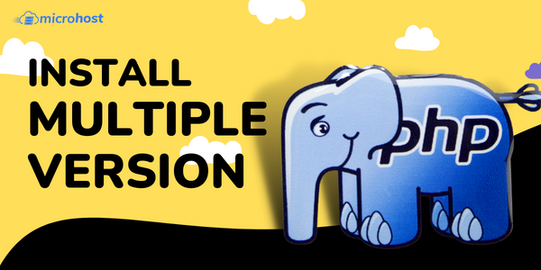

<figure>



<figcaption>

Install multiple version of PHP on Ubuntu server

</figcaption>

</figure>

```
Introduction:
```
In this tutorial, you will learn how to install multiple versions of php on Ubuntu server. [PHP](https://www.php.net/manual/en/intro-whatis.php) is a popular open source general-purpose scripting language that is especially well suited for web development and can be integrated into HTML. PHP is also known as PHP: Hypertext Preprocessor.

```
Prerequisite:
```
Before installing the PHP versions, we must satisfy the minimum requirement to do so.

1. Super user( root) or any normal user with SUDO privileges.
2. Internet should be working on the machines.

## Steps to follow:

**Step 1: Install the dependencies which will be required to install multiple versions of PHP**

```
# apt-get install software-properties-common -y
```

You will use the software-properties-common package's apt-add-repository command-line application to add the ondrej/php PPA (Personal Package Archive) repository.

**Step 2: Now add the ppa:ondrej repository by below command**

```
# add-apt-repository ppa:ondrej/php
```

> Note: Here you will be asked to confirm whether you want to add the repository or not You can confirm the download by just clicking the Enter button. To cancel the download just press Ctrl + C

**Step 3: Now refresh list of available packages.**

```
# apt-get update -y
```

**Step 4: Install the required packages of php, in this example, we have installed php version 7.3**

```
# apt-get install php7.3 php7.3-fpm php7.3-mysql libapache2-mod-php7.3 libapache2-mod-fcgid -y
```

**Step 5: Similarly, install the second version of PHP. In this example, we will install PHP version 7.4**

```
# apt-get install php7.4 php7.4-fpm php7.4-mysql libapache2-mod-php7.4 libapache2-mod-fcgid -y
```

> Note: Here, you will see message, which says that PHP 7.4 FPM is not enabled by default. Therefore, we need to enable that manually.

**Step 6: Similarly, install the second version of PHP. We will install PHP version 8.1**

```
# apt-get install php8.1 php8.1-fpm php8.1-mysql libapache2-mod-php8.1 libapache2-mod-fcgid -y
```

Again, you will see the same message, but this time it will be about php 8.1 version.

**Step 6.2: You can also, install some other basic dependency.**

```
# `apt-get install -y php php-cli php-common php-fpm php-mysql ph-zip php-gd php-mbstring php-curl php-xml php-bcmath openssl php-json php-tokenizer` 
```

**Step 7: Now, finally, we will enable the PHP FPM version by using below command.**

```
# systemctl start php7.4-fpm

```
# systemctl start php8.1-fpm
```

```

By looking at the status of both the FPMs, you will see that both versions are running and started

Note: In order to update the default version of php:

```
update-alternatives --config php
```
In this tutorial, you have learned that how to install multiple version of php on Ubuntu server.

Also Read: [How to install WordPress with LEMP on CentOS server](https://utho.com/docs/tutorial/how-to-install-wordpress-with-lemp-on-centos-server/), [How to install Cockpit on Ubuntu server](https://utho.com/docs/tutorial/how-to-install-cockpit-on-ubuntu-server/)
