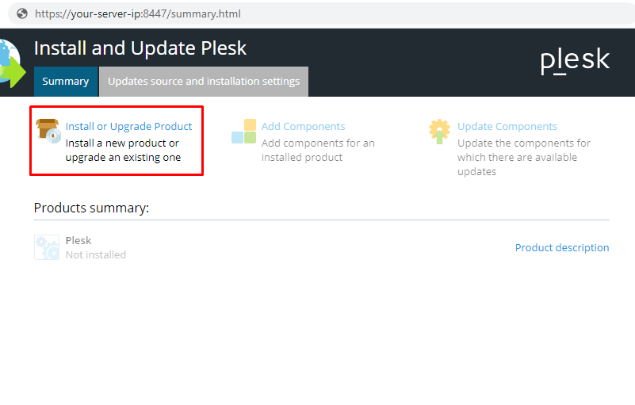
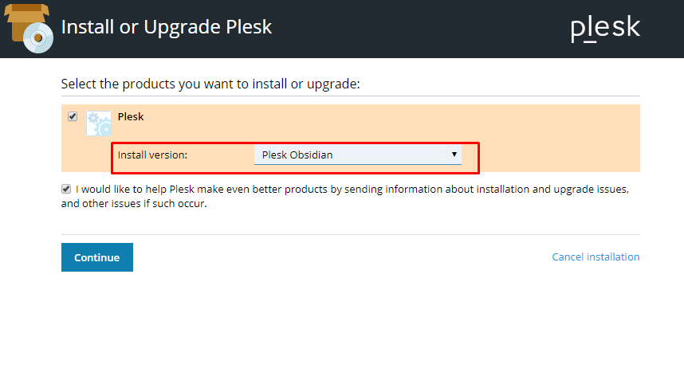

Plesk is a private web host panel that provides users with the ability to administer websites, databases, emails and domains for their personal and/or custome clients. Allows simple point-and-click administration / maintenance via a browser.

## **Method 1**

### One Click Installation

```
 sh <(curl [https://autoinstall.plesk.com/one-click-installer](https://autoinstall.plesk.com/one-click-installer) || wget -O - [https://autoinstall.plesk.com/one-click-installer](https://autoinstall.plesk.com/one-click-installer) --no-check-certificate) 
```

\-----------------------------------------------------------------------------------------------------------------------------------------------------------------------

## **Method** 2

## Install Plesk Using Browser

If your host or IP address can be resolved and the 8447 port is available, you will be able to launch your Plesk Onyx installer through the browser.

1\. Download plesk GUI installer using following below command:

```
 wget https://autoinstall.plesk.com/plesk-installer 
```

2\. Set execution permissions on downloaded Plesk installer using command below.

```
 chmod +x ./plesk-installer 
```

3\. Initiate the Plesk installer with the following command.

```
 ./plesk-installer ----web-interface 
```

4\. Access Installer via browser under port 8447 using IP address

```
 https://your-ip-address:8447 or host https://your-host-name:8447 
```


5\. Enter `"root"` user and password to access the web interface.

6\. Click on "`Install or upgrade product` "



7\. Choose the latest stable version of your product and press `"Continue"`



8\. Select one of the installation types that will identify the list of packages. Or you can just enable "`Select Preview Components`" and choose all the components you like. Click "`Continue`" to proceed with the installation process.


9\. You will see the output of the console inside the web interface. Wait till the installation process is over.


10\. When you will get the message"`All operations with products and components have been successfully completed`." Click Ok" and it will exit the installation page.


11\. Now reboot your server and after reboot configure your plesk panel using plesk url `http://your-server-ip:8880` or `https://your-server-ip:8443` by entering root user and password.

12\. After login in plesk enter the email address for admin notifications and password for admin user.


13\. Enter the Licnese key if you have plesk panel license key or go with "`Proceed with a full-featured trial license`" and Check the button "`I confirm that I've read and accepted the End-User License Agreement` "


15\. Click On `enter plesk`.

Thank You.
