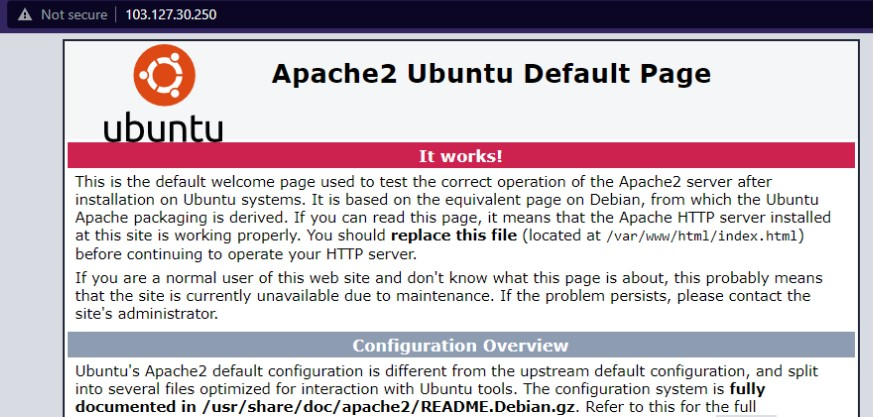

<figure>


<figcaption>

How to install SSL on Ubuntu with Apache2

</figcaption>

</figure>

```
What is SSL
```
Before learning how to install SSL on Ubuntu with Apache2. Let's first learn that SSL, or Secure Sockets Layer, is an Internet security technology based on encryption. It was created by Netscape in 1995 to provide privacy, authentication, and data integrity for Internet interactions. SSL is the forerunner of the current TLS encryption protocol.

A certificate that is self-signed will encrypt communications between your server and any clients. Users cannot use the certificate to automatically authenticate the identity of your server, since it is not certified by any of the trustworthy certificate authorities available in web browsers.

If you do not have a domain name linked with your server and the encrypted web interface is not user-facing, a self-signed certificate may be suitable.

## Prerequisites:

- apt command should be working to install packages
- Internet should be working on the machine
- Super user or normal user with SUDO privileges

## OS and other important files:

- We have used Ubuntu with Apache2 service
- Default Configuration file: /etc/apache2/apache.conf
- SSL Virtual Host file: /etc/apache2/sites-available/default-ssl.conf

### Steps to install the SSL:

**Step 1: Install the Apache2 server on your Ubuntu server using the below command.**

\[console \]apt install apache2 -y\[/console\]

**Step 2: Start the Apache2 service on your server so that you can use it**

```
systemctl start apache2
```

**Step 3: Now to check whether your apache service is running fine or not, go to browser and search your server ip as shown below**



**Step 4: Now if we want to test apache server with a sample source code. Go to the /var/www/html directory and create an index. html file and paste the content shown in the below screenshot.**

```
vim /var/www/html/index.html
```


**Step 5: Now generate the CSR and private key files using below command**

```
openssl req -new -newkey rsa:2048 -nodes -keyout domain.com.key -out domain.com.csr
```

> Note:
> 
> - Here you will be asked to enter a few details. So please enter them as you want.
> - Above command will generate the csr and private key in the present working directory
> - In common name, for the subdomain, you must include an asterisk if you are requesting a unique wildcard SSL certificate. In such scenario, \*.mydomain.com may serve as an example. Never enter any special characters in this area, including "http://", "https://", or any other variation. Never add text after the top-level domain. Your common name, for instance, should finish in.com,.net, or the other extension you are requesting.

Congratulations, a CSR file has been generated.

When getting an SSL certificate, you must copy and paste the whole contents of the CSR file to your Certificate Authority.  
The lines that say "BEGIN CERTIFICATE REQUEST" and "END CERTIFICATE REQUEST" must be included.

**Step 6: Download the validation file from the SSL panel.**

**Step 7: After getting the validation file,**

**Step 7.1:** Your SSL/TLS site's primary configuration file for the Ubuntu server with Apache2 is normally located in /etc/apache2/sites-enabled/default-ssl.conf

**Run the command below if it isn't in the "sites-enabled" directory.**

```
  a2ensite default-ssl.conf 
```

**Now identify the below lines and make sure to have these changes in your default conf file of the website.**

```
vim /etc/apache2/sites-enabled/default-ssl.conf 
```

> ```
> <VirtualHost *:443>     DocumentRoot /var/www/path_to_source_code     SSLEngine on     SSLCertificateFile /path/to/your_domain_name.crt     SSLCertificateKeyFile /path/to/your_private.key</VirtualHost> 
> ```

Note:

> - Value of SSLEngine should be - ‘on’
> - In line SSLCertificateFile should be the path of ssl certificate  
>     In the next line, SSLCertificateKeyFile, mention the path of key file of the SSL
> - In some case, you can receive an error "Certificate Chain is incomplete, missing Certificate(s)", in this case, follow this extra step.
>     - ```
>         Append another line- SSLCertificateChainFile /path/to/gd.bunddle.crt
>         ```
>         

**Step 8: Now run these following commands to reflect the SSL Certificate on your server and reload the Apache2 service**

```
a2enmod ssl 
```

> Note: please mention here the ssl conf file which you used in your server

```
systemctl restart apache2
```

**Step 9: Now Restart the apache service and go to your browser and browse** [**https://server\_Ip**](https://server_Ip) 

Now click on advance, and then "proceed to...(unsafe)"

<figure>


<figcaption>

ssl installed domain

</figcaption>

</figure>

In this tutorial, you have learned how to install SSL on Ubuntu with Apache2

Also Read: [Install SSL on Ubuntu server using Nginx](https://utho.com/docs/tutorial/install-ssl-on-ubuntu-server-using-nginx/), [How to install SSL on CentOS-7.3 with httpd server](https://utho.com/docs/tutorial/how-to-install-ssl-on-centos-7-3-with-httpd-server/)
