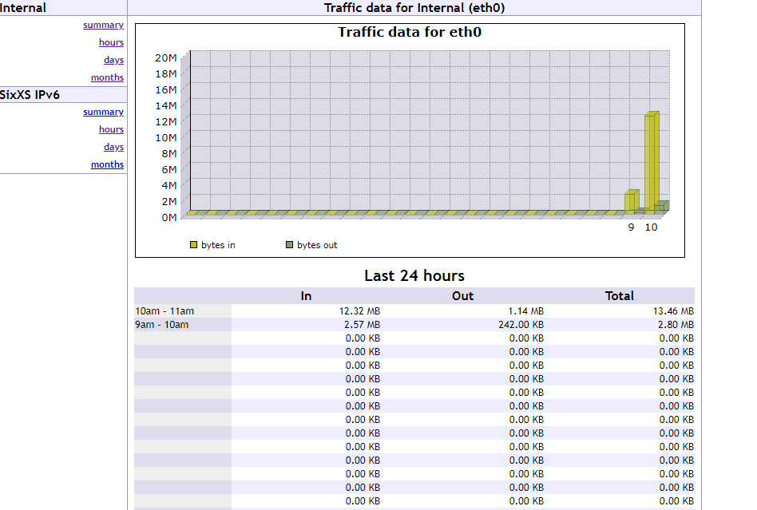

## Console based network traffic monitoring

This article will help you install VnStat network monitoring on your CentOS 7 server. VnStat is console based network traffic monitor for Linux. This will help monitor multiple interfaces at the same time. Several performance options can be configured based on user requirements.

To install VnStat, you need to enable the EPEL repositories package on your Linux server version.

```
yum -y install epel-release
```

You can now install VnStat with the following command.

```
yum -y install vnstat
```

Once the installation is completed, use the following command to start the vnstat service.

```
systemctl start vnstat systemctl enable vnstat chkconfig vnstat on
```

Check the status of the service using the following command.

```
service vnstat status
```

You can monitor the Network by the following commands from the command line.

```
vnstat -----help
```

Output:

```
vnStat 1.16 by Teemu Toivola

-q, --query query database -h, --hours show hours -d, --days show days -m, --months show months -w, --weeks show weeks -t, --top10 show top10 -s, --short use short output -u, --update update database -i, --iface select interface (default: eth0) -?, --help short help -v, --version show version -tr, --traffic calculate traffic -ru, --rateunit swap configured rate unit -l, --live show transfer rate in real time
```

## Install and Configure VnStat PHP Web Based Interface

VnStat also provides a web interface networking monitoring based on php to display graphic statistics. In order to set up a vnStat web interface, required Apache, php and php-gd packages on your system.

If you don't have Apache, you need to install apache web server and php else skip apache and php installation.

**Step 1: Download vnStat Source Archive**

```
wget http://www.sqweek.com/sqweek/files/vnstat_php_frontend-1.5.1.tar.gz
```

**Step 2: Extract Archive**

Extract downloaded archive in apache default root directory **/var/www/html/** using following command.

```
tar xzf vnstat_php_frontend-1.5.1.tar.gz mv vnstat_php_frontend-1.5.1 /var/www/html/vnstat
```

**Step 3: Edit Configuration File**

Edit the config.php**(/var/www/html/vnstat/config.php)** file and set the below parameters as per your setup.

```
$language = 'en'; $iface_list = array('eth0', 'sixxs'); $iface_title['eth0'] = 'Public Interface'; $vnstat_bin = '/usr/bin/vnstat';
```

**Step 4: Now you can access vnStat in Web browser**:- Using your cloud server ip or domain name.

```
http://192.168.1.90/vnstat/
or
http://web.microhost.com/vnstat/
```


