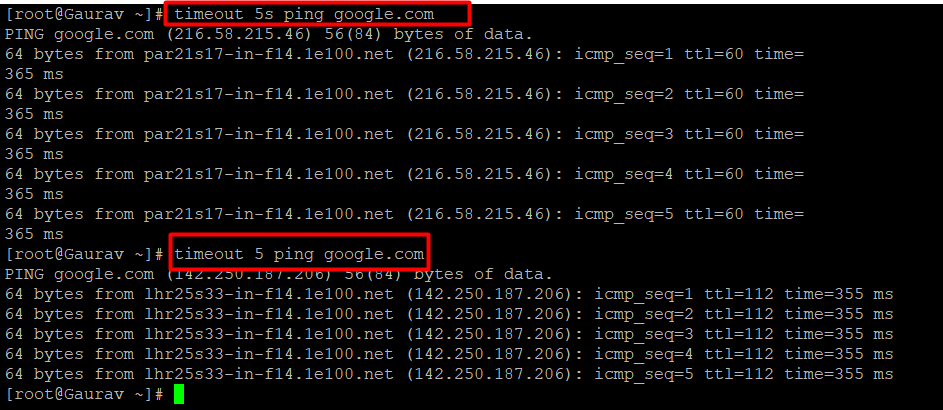

#### **Description**  

Linux comes with a plethora of commands, each of which serves a specific purpose and has its own unique set of parameters. Linux is designed to make your computing experience as brisk and productive as it possibly can be. The maximum allowed amount of time is one of the characteristics of a Linux command. Any command that you run can have a timer attached to it if you so choose. If the specified amount of time elapses, the command will no longer be carried out.

In this brief tutorial, you are going to learn two different ways that you can implement a time limit into the commands that you write.

##### **Timeout Tool for Executing Linux Commands**

You are able to execute a command in Linux with a time limit because the operating system comes with a utility for the command line called a timeout.

The following is an example of its syntax:

```
#timeout [OPTION] DURATION COMMAND [ARG]…
```

You must include a timeout value, measured in seconds, along with the command that you want to execute in order to use the command. You could, for instance, run the following command to timeout a ping command after 5 seconds.

```
#timeout 5s ping google.com
```


After the number 5, the s is optional. The following command remains the same and continues to function.

```
#timeout 5 ping google.com
```




Some other endings are:

- **m** representing minutes
- **h** representing hours
- **d**  representing days

Even after the timeout has sent the initial signal, the commands may continue to run in some circumstances. The —kill-after option is available for use in situations like these.

Here is the syntax for it.

```
#-k, --kill-after=DURATION
```

You are required to provide timeout with a duration so that it is aware after how much elapsed time the kill signal is to be transmitted.

For instance, the command that is being displayed will be aborted after a period of 8 seconds.

```
#timeout 8s tail -f /var/log/messages
```


- The Timeout command is simple to use, while the Timelimit utility is more difficult to understand but provides more customization options. Your requirements will determine which of the available options is the best fit for you to select.

##### **Thank You**
