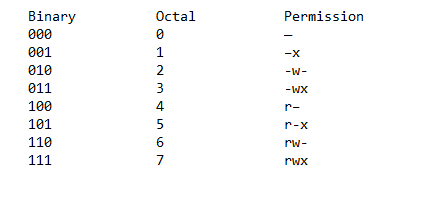

### Chmod Helps you to alter Linux read and write permissions

Unix-like systems, including those operating on Microhost platforms, have an extremely flexible mechanism for access control that enables system administrators to easily allow multiple users to have access to a single system without requiring all users to access all files in the file system. The simplest and fastest way to modify these file permissions is to use the chmod command.

### How to Use chmod

Chmod refers in this guide to recent chmod versions, like those provided by the GNU project. By default, chmod is included with all microhost images and included in the common "base" selection of packages available in almost all Linux-based operating system distributions.

### Linux File Permission Basics

All Unix-like file system object is allowed to read, write, and execute access to three major types of permissions. The three possible classes are authorized: the user, the user group and all system users.

Use to view a set of files' file permissions:

```
 [root@Microhost ~]# ls -lha 
```

There are ten characters representing the permission bits in the first column of the output. See the section on octal notation below to understand why they are called permission bits.

```
dr-xr-x---.  3 root root 4.0K Apr 11  2018 .
dr-xr-xr-x. 18 root root 4.0K May 11 03:35 ..
-rw-------.  1 root root 1.3K Jan 18  2017 anaconda-ks.cfg
-rw-------.  1 root root  597 May  9 12:29 .bash_history
-rw-r--r--.  1 root root   18 Dec 28  2013 .bash_logout
-rw-r--r--.  1 root root  176 Dec 28  2013 .bash_profile
-rw-r--r--.  1 root root  176 Dec 28  2013 .bashrc
-rw-r--r--.  1 root root  100 Dec 28  2013 .cshrc
drwx------ 2 root root 4.0K May  9 03:34 .ssh
-rw-r--r--.  1 root root  129 Dec 28  2013 .tcshrc
```

The division of the bits into groups is one way of understanding the meaning of this column.


The first character is the file type. The remaining nine bits in three groups represent the user, group and worldwide permissions. Everyone means:

- `r`: **R**ead
- `w`: **W**rite
- `x`: e**X**ecute

\[ht\_message mstyle="alert" title="NOTE" " show\_icon="true" id="" class=""style="" \]Note that access to files targeted by symbolic links is controlled by the permissions of the targeted file, not the permissions of the link object..\[/ht\_message\]

### chmod Command Syntax and Options

The chmod command format is the following:

```
 [root@Microhost ~]# chmod [who][+,-,=][permissions] filename 
```

Consider the chmod  command below :

```
 [root@Microhost ~]# chmod g+w ~/microhost.txt 
```

This allows all user groups who have written permissions to the ~/microhost.txt file. Additional options for modifying targeted user permissions are:


The operator + allows, while the operator - removes permissions.you are also allowed to copy permissions:

```
 [root@Microhost ~]# chmod g=u ~/microhost.txt 
```

The parameter g=u means grant group permissions to be same as the user’s.

The following example can specify multiple allowances by separating with a comma:

```
 [root@Microhost ~]# chmod g+w,o-rw,a+x ~/microhost.txt 
```

In this way, the user groups add written permissions and remove reading and writing permissions from the "other" system users. Finally, a+x gives all categories execute permissions. This value can also be set to + x. In the absence of a category, all permission categories shall be added or withdrawn.

In this notation, the owner of the file is referred to as the user (e.g. u+x).

```
 [root@Microhost ~]# chmod -R +w,g=rw,o-rw, ~/microhost.txt 
```

The -R option applies the amendment of permissions to the specified directory and all its contents recursively.

### How to Use Octal Notation for File Permissions

Octal notation is another way of setting permissions.

The following is an instance of a file authorization equivalent to chmod u=rwx, g=rx, o =

```
 [root@Microhost ~]# chmod 750 /microhost.txt 
```

The permissions for this file are `- rwx r-x ---`.

Without considering the first bit, every bit with a-can be replaced with a 0 while r, w, or x is 1. The conversion is as follows:



The two other digits are separate from each other. Thus, 750 means the user could read , write or run, the group could not write, and other users could not read , write or run.

744, the default type permit allows the user to read , write and execute licenses and group and "world" user read permissions.

Either notation is equivalent and any form that expresses your permission requirements can be used more clearly.

### Making a File Executable

The following examples change the file permissions so that any user can execute the file “~/microhost-project.py”:

chmod +x ~/microhost-project.py

Thank You :)
