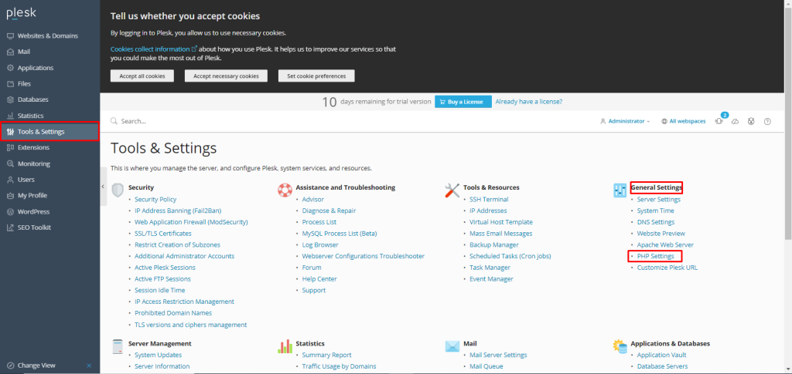
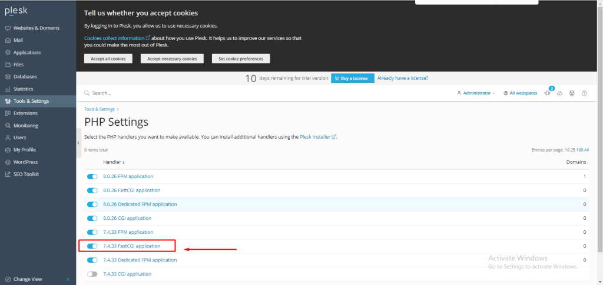
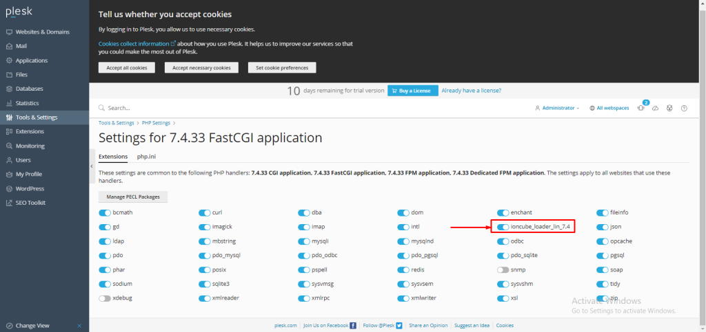

## Introduction

In this article, you will learn how to enable IonCube Loader in Plesk.

The ionCube PHP Encoder package is responsible for encoding PHP scripts, while the [ionCube](https://www.ioncube.com/) Loader PHP extension is responsible for decoding such scripts.

Step 1. Log into your Plesk with your server password by searching server\_ip:8880 in your browser.

Step 2. Click on tools and settings, which is located on the left side of the screen, and then choose php settings from the menu of general settings that appears after clicking on tools and settings.

Step 3. Due to the fact that the ioncube loader is now standard in all Plesk PHP packages, the extension must be enabled for versions of PHP prior to 12.5.

Click on any lesser PHP version other than 12.5; for example, we have clicked on the 7.4.33 FastCGI application, then open the [extension tab](https://utho.com/docs/tutorial/how-to-add-or-remove-components-in-plesk/).

Step 4. Then click on the "ioncube" option to enable it.

Thank You 🙂
