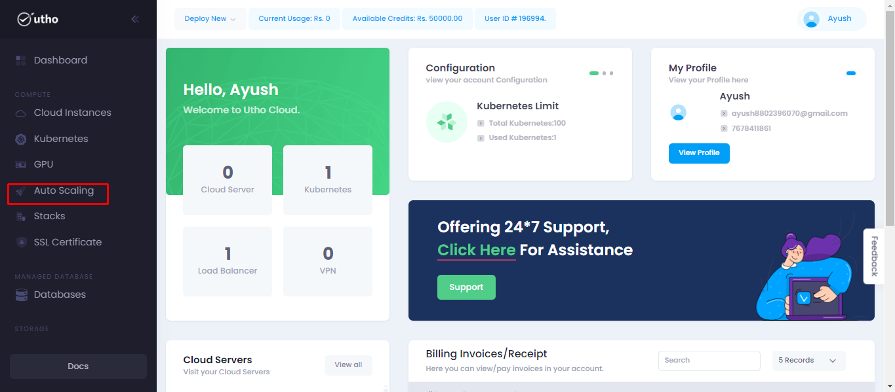
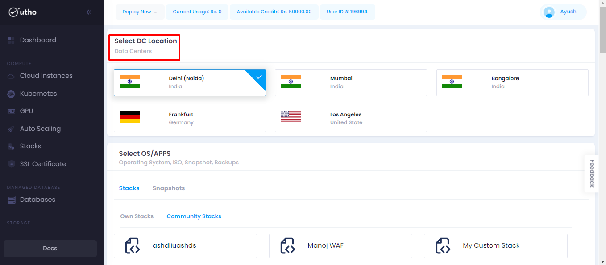
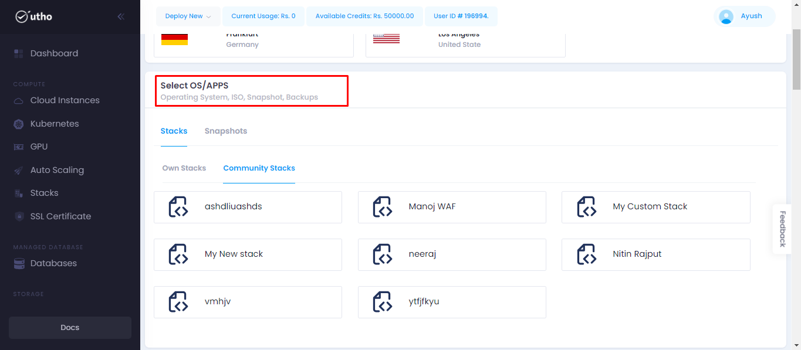
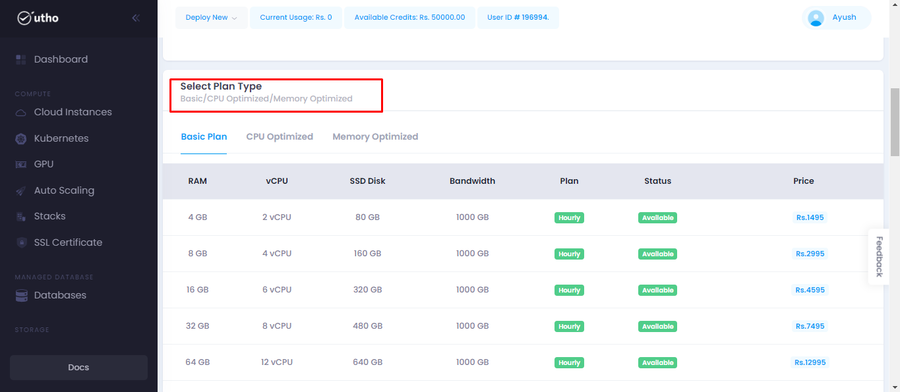
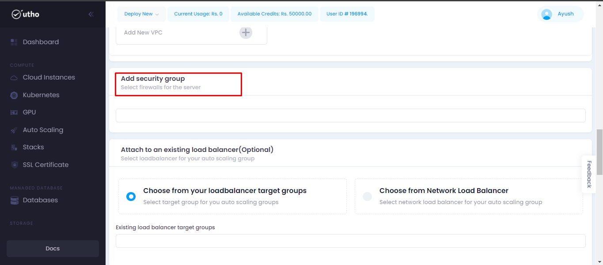
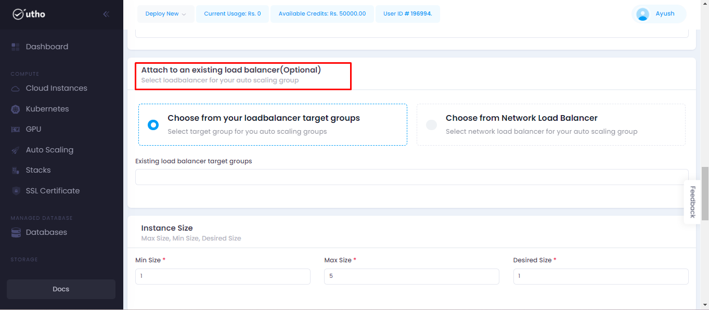
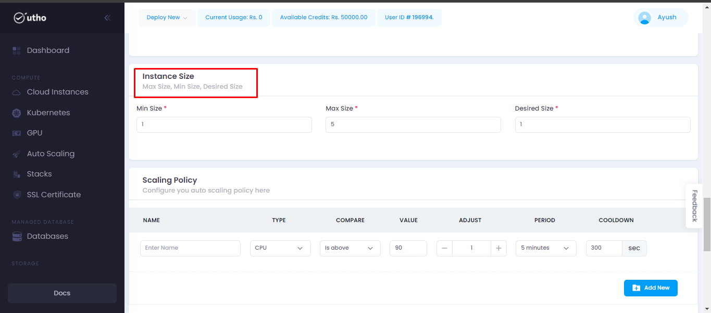
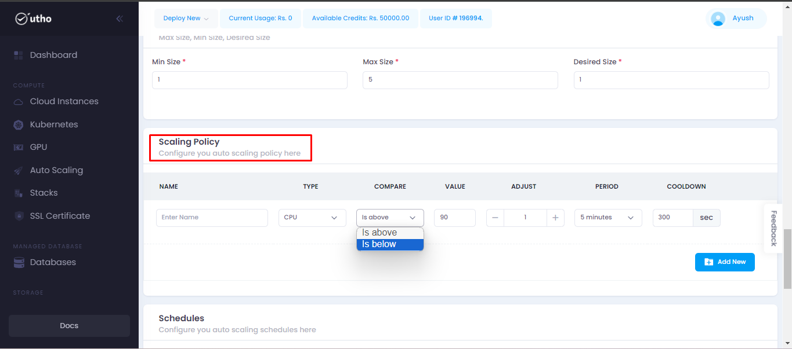
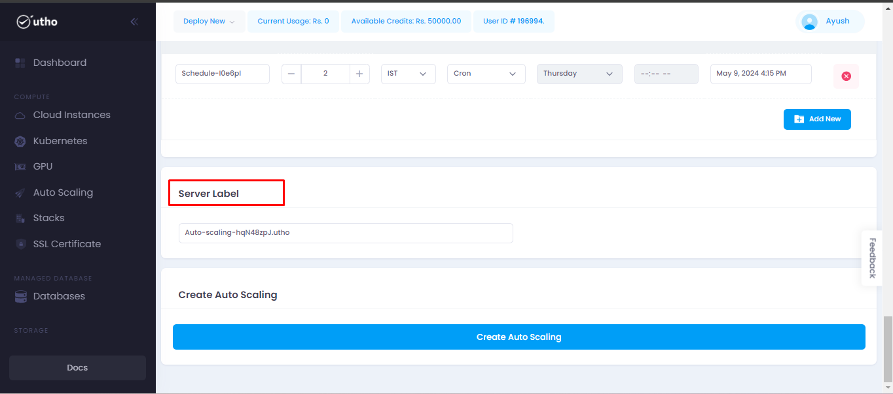
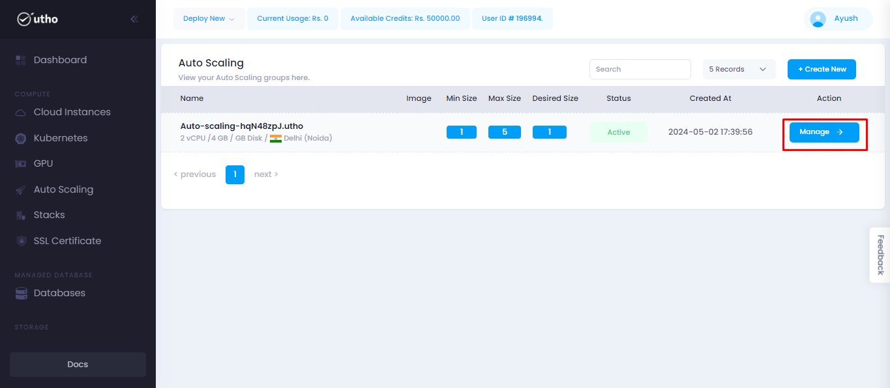

# Auto Scaling
--- 

Auto scaling in cloud computing refers to the ability of a system to automatically adjust its computing resources based on workload changes. This is particularly useful in scenarios where the demand on the system fluctuates, such as web applications experiencing varying levels of traffic throughout the day.

## Auto Scaling offer several benefits:
- Monitoring
- Scaling Policies
- Scaling Actions
- Integration with Cloud Provider Services
- Cost Optimization

## Steps for approaching the Auto Scaling:
---
#### Visit on the link given below:
>
[Console url](https://console.utho.com/)
1. This link will redirect you to the Dashboard after Login of the platform. 

2. On clicking on Auto Scaling button on the left hand side , it will redirect user to te homepage of auto scaling.
 

3. After clicking on Auto Scaling it will redirect user to the homepage of auto scaling . Where user will get two option for creating auto scaling group.

4. After clicking on create new, a new page will occur where user will choose the required details for there  auto scalling.

5. Select the DC Location as per the requirement.

6. Select OS/Apps or select the stacks as per requirement.

7. Now select the Plan Type as per the consumption.

8. Now select the VPC network for your cluster.

9. Now select the firewall for the server, it will keep the server away from the threats.

10. Now Select LoadBalancer for your auto scaling group.

11. Now provide the Instance Size:
- Min size
- Max size
- Desired size

12. Here user can configure their auto scaling policy.
- Name
- Type
- Compare
- Value
- Adjust
- Period
- Cooldown

13. Here user can configure their auto scaling schedules here:
- Name
- Desired Size
- Time zone
- Recurrence
- Day 
- Time
- Start At

14. Under server label user can provide the name for there auto scaling server.

15. After filling all the required details click on Create Auto Scaling then auto scaling will be created.

16. After clicking on create auto scaling it will redirect user to the homepage of Auto Scaling where user can see all then created auto scaling.

17. Click on manage button to explore more about the Auto Scaling.

18. 

