# Container Registry
--- 
A container registry is a repository for storing and managing container images. It's a core component in modern cloud-native development and deployment workflows.

### Container Registry offer several benefits:
- Scalability
- Cost-effectiveness
- Integration
- Storage and Organization
- Security
- Version Control
- Distribution

### Steps for approaching the Container Registry:
---
#### Visit on the link given below:
>
[Console url](https://console.utho.com/)
1. This link will redirect you to the Dashboard after Login of the platform. 

 

2. Here on click on L.H.S tab , we will see the Container Registry.

 

3. On clicking on the container registry it will redirect to the container registry home page as shown below:
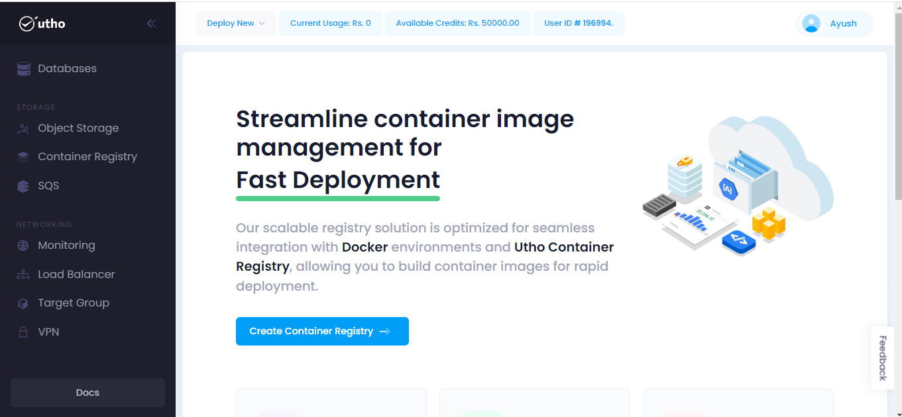
 
4. Now , Click on the Create Container Registry for creating repos.
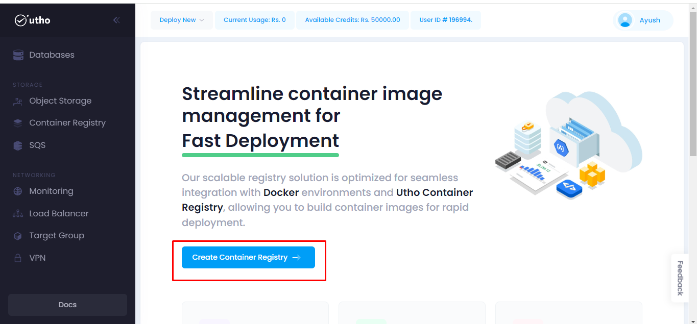
 

5. On click, It will redirect to the next page where we can start the process of craeting registry.
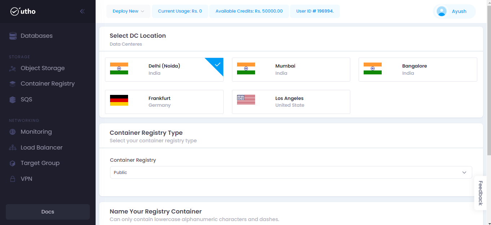
 

6. Now, the user select the DC Location for  which then need the container registry.
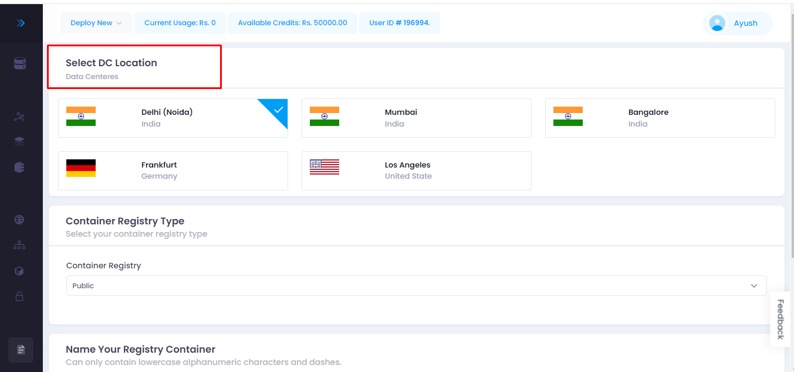
  

7. Now the user will select the container registry type as per requirement from the dropdown as shown below.
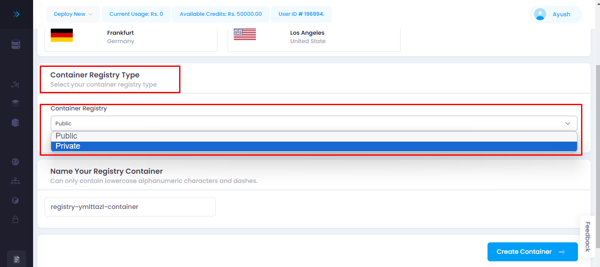 
 

8. In this section user will provide a name for their registry container and then click on Create container button.
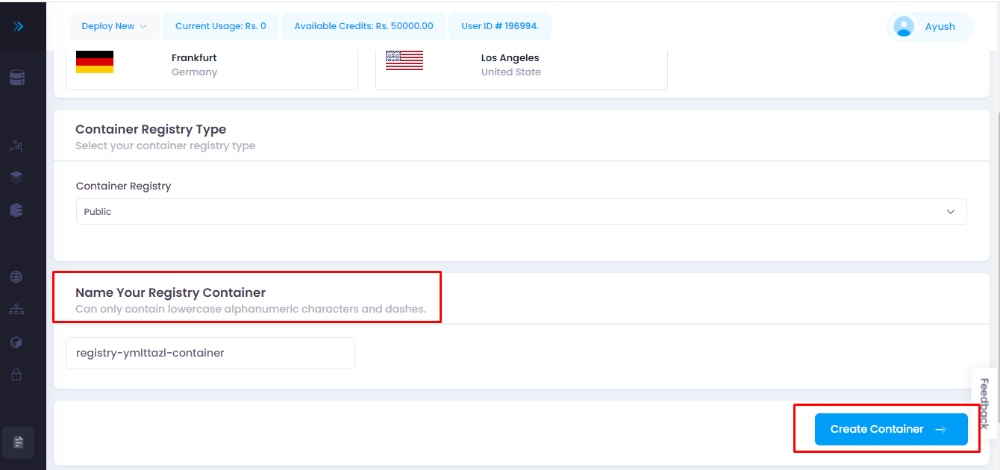
 

9. After clicking on create container it will redirect us to the next page as shown below.
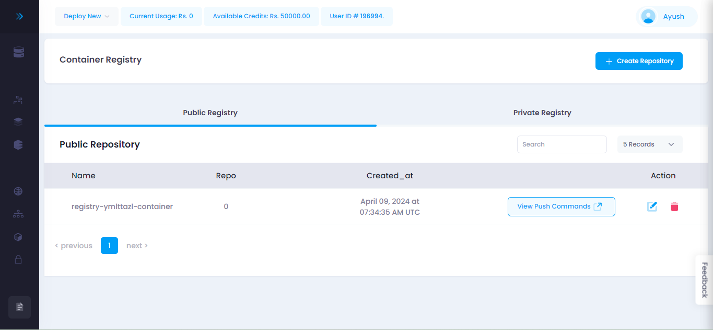
 

#### Process involved after the creation of Container Registry.

 After the step (9) , the user will get 2 Registry :
 - Public Registry
 - Private Registry

10. In this the created registry will be stored according to the container registry type.

Once the repository is created then click on edit icon shown in the snippet given below, With the help of that user can update there registry from public to private and vice-versa.
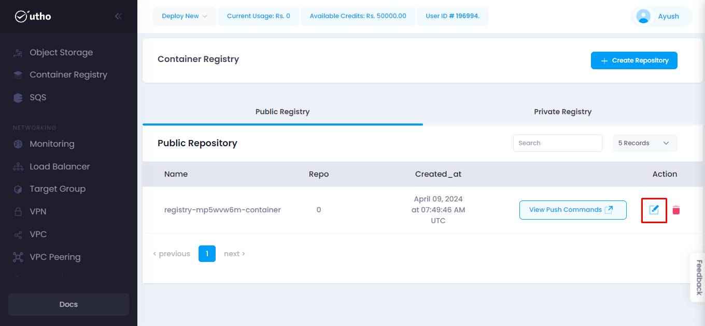

Then a pop up will occur where user can see the update option.
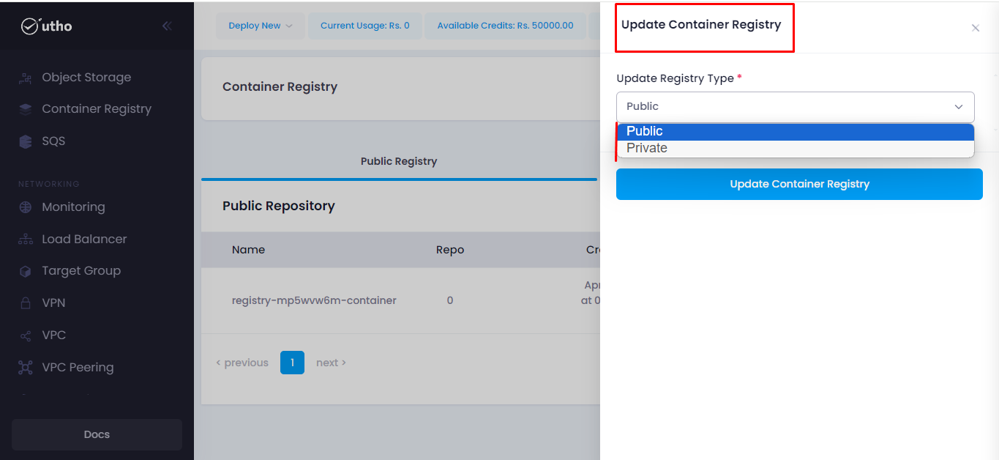

11. Click on the View Push Commands.
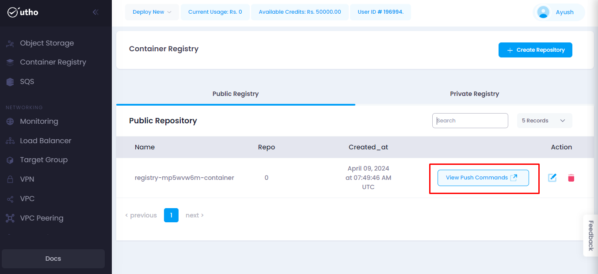

12. A new slide window will open where `Command references for pushisng an artifact to this project` will be available as shown in the snippet below.

 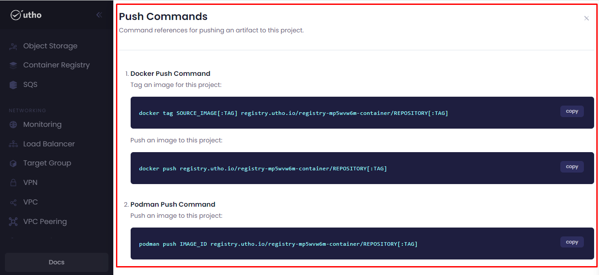
 After copying these commands user can easily push their item to the required place.

 By clciking on this icon user can delete the repository.
 

 ---
**THE END**
