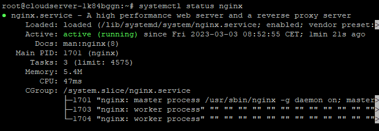

## Introduction

In this article, you will learn how to install NGINX Web Server on Ubuntu 22.04 LTS.

[NGINX](https://en.wikipedia.org/wiki/Nginx) is free software that can be used for serving web pages, reverse proxying, caching, balancing the load, streaming media, and more. It began out as a web server meant to be as fast and stable as possible. In addition to being an HTTP server, NGINX may also act as a proxy server for email (IMAP, POP3, and SMTP) and as a reverse proxy and load balancer for HTTP, TCP, and UDP servers.

## Install NGINX

1\. Install NGINX with the use of the package manager.

```
# apt install nginx -y

```

2\. The NGINX service immediately begins its normal operation. You can use the following command to check the current state of it:

```
# systemctl status nginx

```



3\. You can start using NGINX another time with the following command:

```
# systemctl enable nginx

```

4\. Your system's firewall must be configured to allow traffic over port 80. UFW, which stands for Ubuntu Firewall, is the frontend that is most commonly used to administer firewall rules on Ubuntu. You can open port 80 with ufw by using the example commands, and then reload the rules to make the changes you made take effect.

```
# ufw allow http

```


```
# ufw reload

```


5\. To check out how well your installation is working, go to the default NGINX website. You'll locate it by going to the server's IP address in your browser.

```
# http://server\_ip

```


#### Use NGINX

Through the use of NGINX, this section will guide you through the process of putting up your own website. This explains not only how to set up an NGINX proxy to deliver static content but also how to do so.

## NGINX Configuration

1\. Disable the NGINX configuration file that is provided by default.

```
# unlink /etc/nginx/sites-enabled/default

```

2\. Generate an NGINX configuration file for the website you're working on. In this example, replace both the filename and the contents of the file with your site's domain. Do the same thing from now on anytime you see example.com.

```
# vi /etc/nginx/sites-available/example.com

```

Paste the following content in this file:

```
server {
    listen 80;
    listen [::]:80;
    server_name  example.com;

    root /var/www/example.com;
    index index.html;

    location / {
        try_files $uri $uri/ =404;
    }
}
```

3\. Bring your NGINX site live.

```
# ln -s /etc/nginx/sites-available/example.com /etc/nginx/sites-enabled/

```

4\. Run the following command to check if the NGINX configuration file is correct or not:

```
# nginx -t

```


5\. In order for changes to take effect, you will need to restart NGINX.

```
# systemctl restart nginx

```

## Set Up the Website

1\. Make a directory to store the content of your NGINX website.

```
# mkdir /var/www/example.com

```

2\. In the new NGINX site directory, you must create an index.html page.

```
# vi /var/www/example.com/index.html

```

Paste the following content in this file:

```
<!doctype html>
<html>
<body>
    <h1>Hello, Guys!</h1>
    <p>This is an example website running on NGINX.</p>
</body>
</html>
```

3\. Just type your site's domain name into a browser to check it out. There should be a "Hello, Guys!" page shown on your domain.


## Conclusion

Hopefully, you have learned how to install NGINX Web Server on Ubuntu 22.04 LTS.

Also Read: [How to host a domain on centos 7](https://utho.com/docs/tutorial/how-to-host-a-domain-on-centos-7/)

Thank You 🙂
