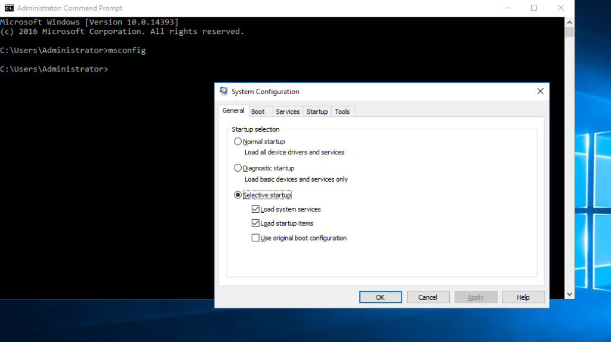
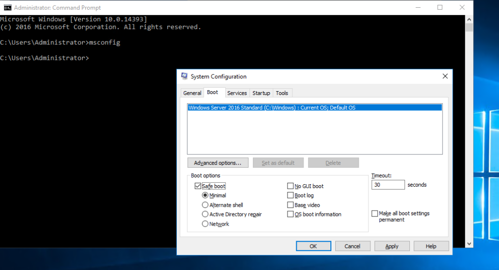
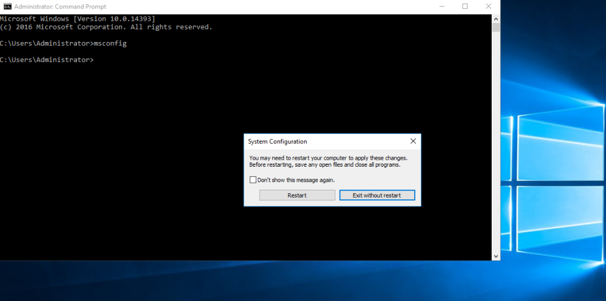

## Introduction

In this article, you will learn how to [boot windows](https://en.wikipedia.org/wiki/Booting_process_of_Windows) server into safe mode.

Safe Mode is an unique Windows boot-up mode that can be used to restart the computer once a major problem has occurred that interferes with normal Windows functions and activities. Safe Mode enables users to debug and find the root cause of a fault.

In safe mode, an operating system has reduced functionality; however, the process of isolating problems is facilitated by the fact that many non-essential components, such as sound, are disabled. An installation that will only boot into safe mode typically has a significant issue, such as disc corruption or the installation of software with improper configuration, which prevents the operating system from successfully booting into its normal operating mode and allowing the user to use the computer as intended.

A user is normally granted access to utility and diagnostic programs when operating in safe mode. This enables the user to investigate and resolve issues that prevent the operating system from functioning normally. The functionality of the system is not meant to be used while in safe mode, and user access to features is severely restricted.

You have to login into your window server.

Step 1. On the right side of the window, search cmd and click on Command Prompt.


Step 2. Now run the msconfig command.

```
# msconfig

```



Step 3. Now click Left on the boot option, which is next to the general.


Step 4. Go to the Boot menu, and then choose "Safe boot" from the list of "Boot settings."



Step 5. After pressing OK, the below screenshot will show on your screen. Select the Restart option to apply the changes.



Step 7. After selecting Restart, you have to log into your server again and you will see a black screen on your server. That means your server is now in safe mode.


## Conclusion

Hopefully, you have learned how to boot windows server into safe mode.

Also read: [How to Install OpenSSH on Windows Server](https://utho.com/docs/tutorial/how-to-install-openssh-on-windows-server/)

Thank You 🙂
