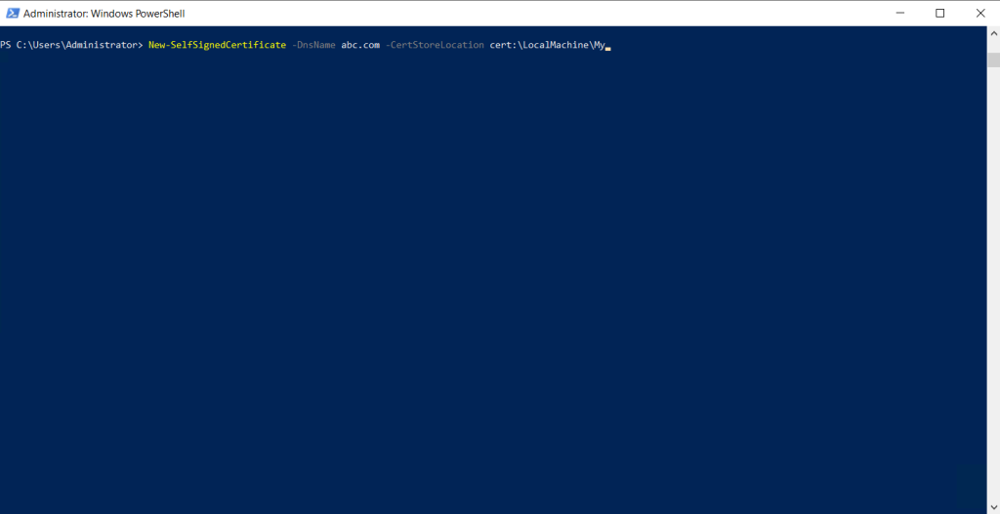
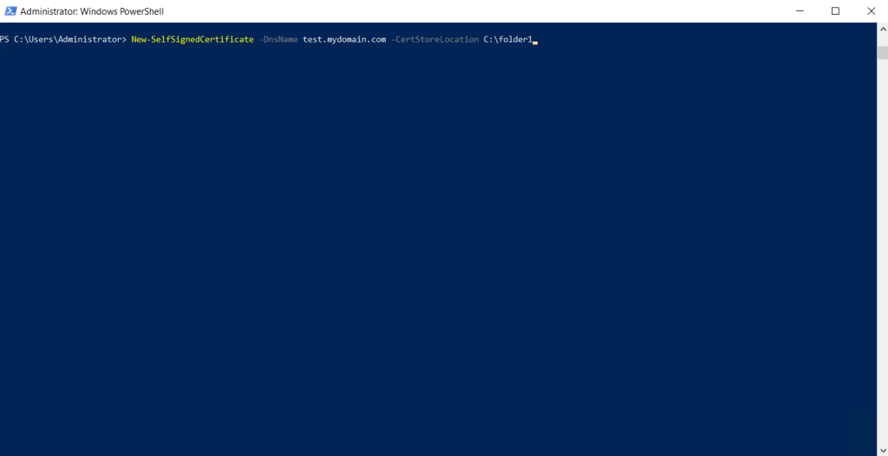
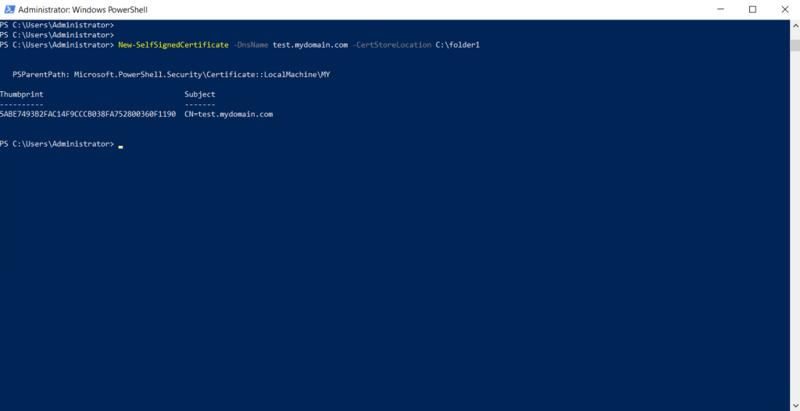
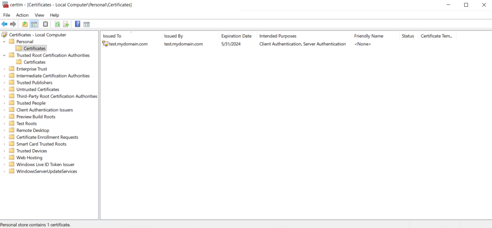

### INTRODUCTION

In cryptography and computer security, self-signed certificates are public key certificates that are not issued by a certificate authority. These self-signed certificates are easy to make and do not cost money. However, they do not provide any trust value. On modern Windows versions ([Windows Server](https://utho.com/docs/tutorial/how-to-install-ssl-on-windows-server/) 2022/2019/2016/2012R2) you can create a self-signed certificate using the built-in PowerShell cmdlet `[New-SelfSignedCertificate](https://learn.microsoft.com/en-us/powershell/module/pki/new-selfsignedcertificate?view=windowsserver2022-ps)` without using additional tools. In this tutorial, we will learn how to Create a Self-Signed Certificate in Windows Server.

#### Prerequisites

- Windows Server

- [PowerShell](https://en.wikipedia.org/wiki/PowerShell) with Administrator

- Internet connectivity

Step 1. Login to your Windows Server

Step 2. Open PowerShell with Administrator

Step 3. Run the following command to generate a self-signed certificate

Step 4. We will edit the domain name and certificate location according to our preference.

Step 5. Self-signed certificate generated.

Step 6. Check our recently generated self-signed certificate by running **certlm.msc** in run.

Thank You!
