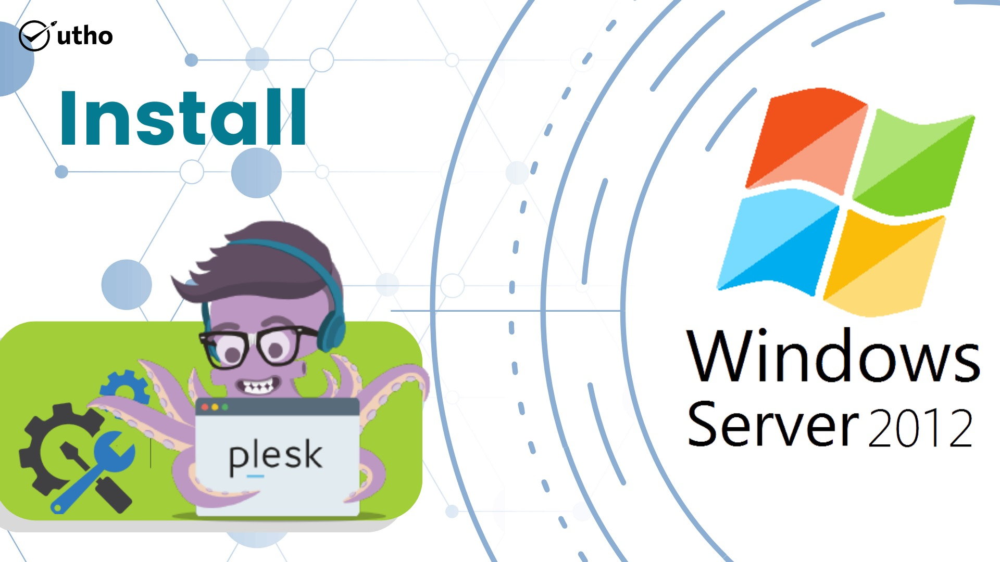
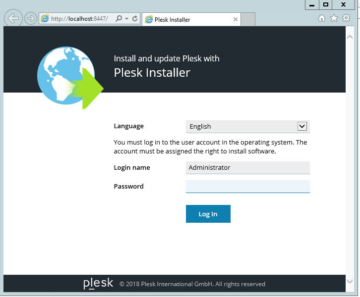
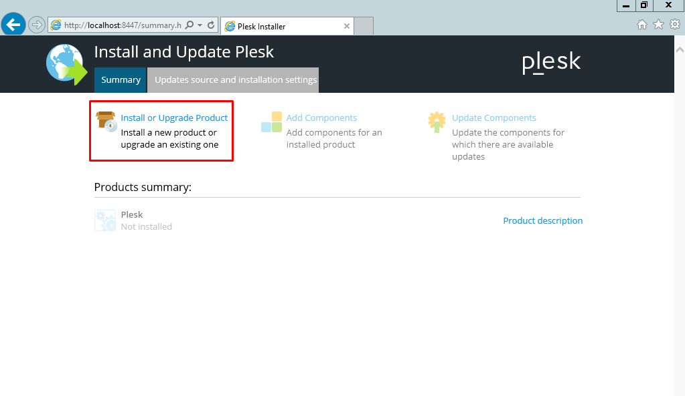
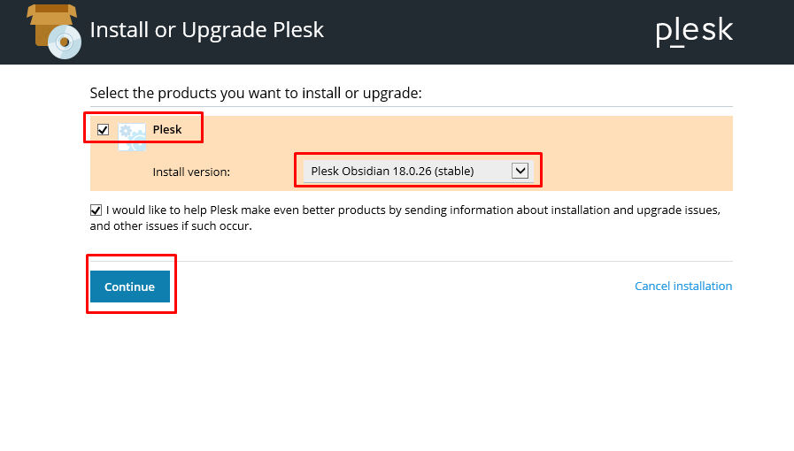
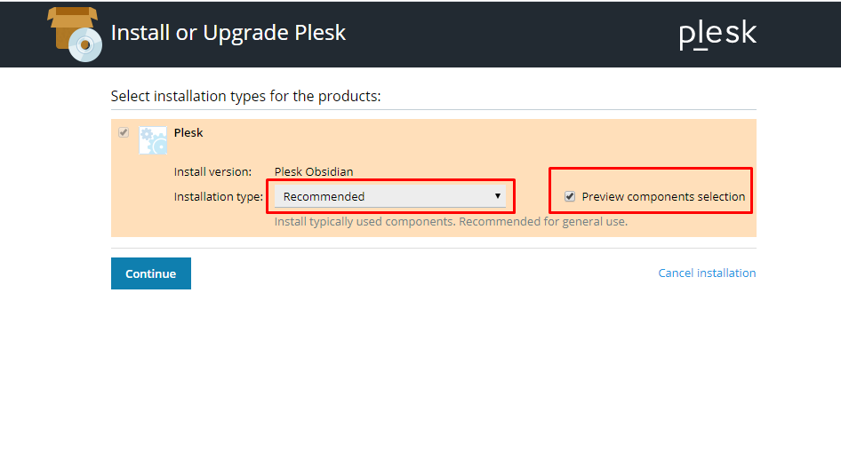
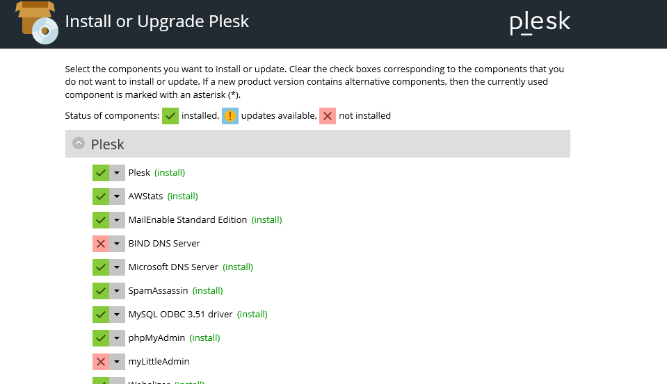
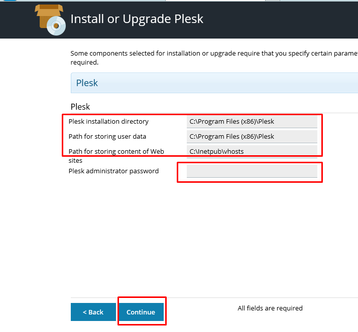
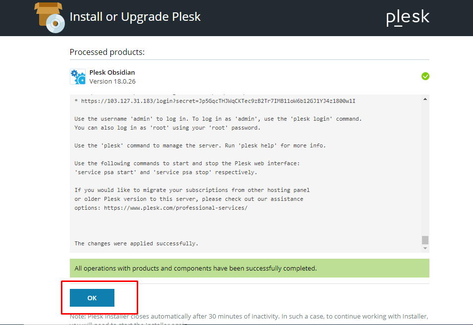
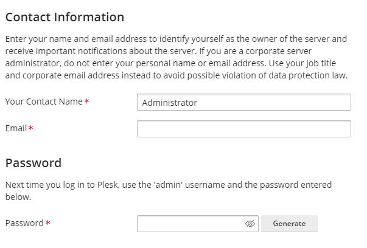
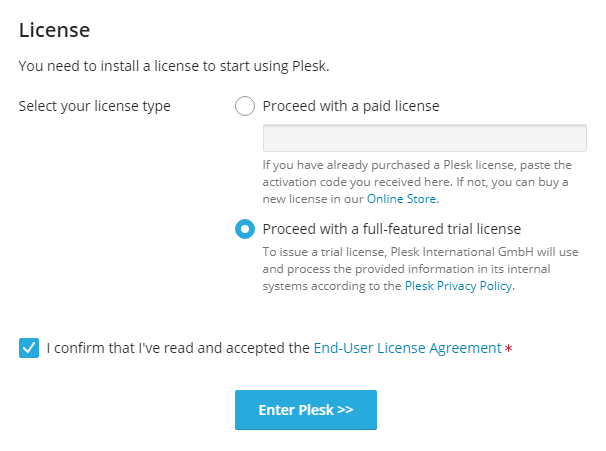

To Install Plesk in windows using browser,You need to follow below steps.

1\. Login on your server using RDP.

2\. Download plesk installer [Plesk Installer](https://installer-win.plesk.com/plesk-installer.exe).

3\. Double click on downlaoded `plesk installer` file.

4\. It will open command prompt and your server default browser itself.

4\. Enter your server `administrator user password` for next.

5\. Click on "`Install or Upgrade your product`"

6\. Choose the latest stable version of your product and press `"Continue"`

7\. The installation type determines which Plesk components and features are to be installed. The following types of installation are available:

- The `Recommended` installation type includes all components necessary for web hosting (including web server, mail server, database server, etc.) plus the most popular and widely used features. If you don't know what type of installation to choose, going with Recommended is a safe bet.
- The `Full Installation` Type includes all Plek components and features. Note that choosing this type of installation will require the most disk space.
- The `Custom installation` type allows you to choose and install items from the list of all available components and features. This type of installation is recommended for experienced Plesk administrators.

You can choose an installation type that is not suited to your needs-you will be able to `add or remove` Plesk components at any time after the installation has finished.

The custom installation type looks like-mark the components you want to install with the green checkbox icon, select the red cross icon for those you don't need. When you're satisfied with the components you've selected, click Continue to move forward.

8\. You will see following setting in screenshot which you can change according to your requirement.

9\. If you want to install plesk with `default setting`. Enter the password of administrator user and click on continue for proceed installation.

10\. You will see the output of the console inside the web interface. Wait till the installation process is over.

11\. When you will get the message”`All operations with products and components have been successfully completed`.” Click Ok” and it will exit the installation page.

12\. Now reboot your server and after reboot configure your plesk panel using plesk url `http://your-server-ip:8880` or `https://your-server-ip:8443` by entering administrator user and password.

13\. After login in plesk enter the email address for admin notifications and password for admin user.

14\. Enter the Licnese key if you have plesk panel license key or go with “`Proceed with a full-featured trial license`” and Check the button “`I confirm that I've read and accepted the End-User License Agreement` “

15\. Click On `enter plesk`.
